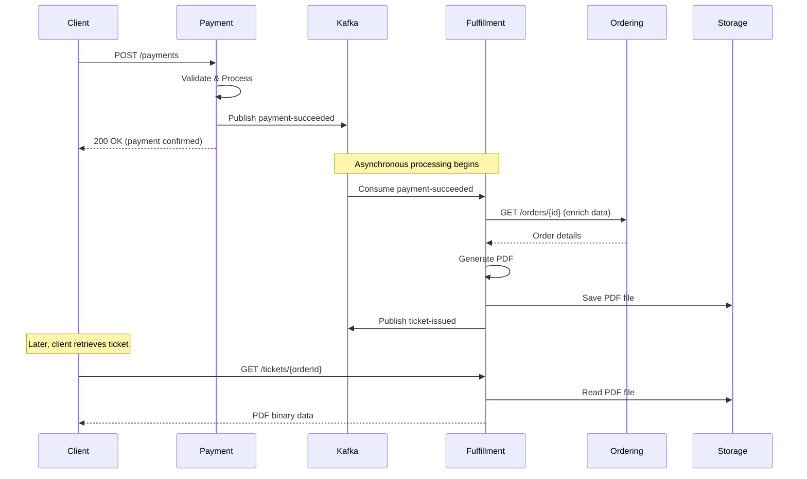

Retrieve a ticket PDF file that was generated after successful payment processing. This endpoint returns the actual PDF file that can be displayed, downloaded, or sent to customers.

<Info>
Tickets are automatically generated when the fulfillment service receives a `payment-succeeded` event from Kafka. This endpoint allows you to retrieve the generated PDF after it has been created.
</Info>

## Ticket generation workflow

The ticket generation process is fully event-driven and asynchronous:

1. **Payment succeeds** - The payment service publishes a `payment-succeeded` event to Kafka
2. **Event consumed** - The fulfillment service listens on the `payment-succeeded` topic
3. **Order enrichment** - The service fetches additional order details from the ordering service
4. **Ticket creation** - A ticket record is created with status `pending`
5. **PDF generation** - A PDF is generated with event details, seat info, and QR code
6. **Storage** - The PDF is saved to the local filesystem (`/app/data/tickets/{ticketId}.pdf`)
7. **Database update** - The ticket record is updated with status `generated` and the PDF path
8. **Event publishing** - A `ticket-issued` event is published to notify other services

<Note>
Ticket generation is **idempotent**. If the fulfillment service receives multiple `payment-succeeded` events for the same order (e.g., due to event replay), it will only generate one ticket.
</Note>

## Path parameters

<ParamField path="path.orderId" type="string" required>
  The unique identifier of the order. Can be provided with or without the `.pdf` extension. Must be a valid GUID format.
  
  Examples:
  - `550e8400-e29b-41d4-a716-446655440000`
  - `550e8400-e29b-41d4-a716-446655440000.pdf`
</ParamField>

## Response

<ResponseField name="Content-Type" type="string">
  The response content type will be `application/pdf` for successful requests.
</ResponseField>

<ResponseField name="Content-Disposition" type="string">
  The response will include a `Content-Disposition` header with the filename in the format `{ticketId}.pdf`.
</ResponseField>

The response body contains the binary PDF file data that can be:
- Displayed inline in a browser
- Downloaded to the user's device
- Sent as an email attachment
- Stored in cloud storage (S3, Azure Blob, etc.)

## Ticket data structure

Each ticket contains comprehensive event and customer information stored in the database before PDF generation.

### Ticket entity fields

<Accordion title="Ticket database schema">
  <ResponseField name="id" type="string">
    Unique identifier for the ticket (GUID).
  </ResponseField>
  
  <ResponseField name="orderId" type="string">
    The order this ticket was generated for (GUID).
  </ResponseField>
  
  <ResponseField name="customerEmail" type="string">
    Customer's email address for ticket delivery.
  </ResponseField>
  
  <ResponseField name="eventName" type="string">
    Name of the event (e.g., "Taylor Swift - Eras Tour").
  </ResponseField>
  
  <ResponseField name="seatNumber" type="string">
    Assigned seat identifier (e.g., "A-15", "Section 3, Row B, Seat 12").
  </ResponseField>
  
  <ResponseField name="price" type="number">
    Ticket price in decimal format.
  </ResponseField>
  
  <ResponseField name="currency" type="string">
    Three-letter ISO currency code (e.g., "USD").
  </ResponseField>
  
  <ResponseField name="status" type="string">
    Current ticket status. Possible values:
    - `0` - Pending (ticket record created, PDF generation in progress)
    - `1` - Generated (PDF created successfully)
    - `2` - Failed (PDF generation failed)
    - `3` - Delivered (ticket sent to customer)
  </ResponseField>
  
  <ResponseField name="qrCodeData" type="string">
    QR code data string in the format `{orderId}:{seatNumber}:{eventId}`. This QR code is embedded in the PDF and can be scanned at the venue for validation.
  </ResponseField>
  
  <ResponseField name="ticketPdfPath" type="string">
    Relative file path to the stored PDF (e.g., `tickets/550e8400-e29b-41d4-a716-446655440000.pdf`).
  </ResponseField>
  
  <ResponseField name="generatedAt" type="string">
    ISO 8601 timestamp when the PDF was successfully generated.
  </ResponseField>
  
  <ResponseField name="createdAt" type="string">
    ISO 8601 timestamp when the ticket record was created.
  </ResponseField>
  
  <ResponseField name="updatedAt" type="string">
    ISO 8601 timestamp of the last update to the ticket record.
  </ResponseField>
</Accordion>

## PDF generation details

The ticket PDF is generated using **PdfSharpCore** library and includes:

### PDF content

- **Header** - "TICKET DE ENTRADA" title
- **Event information**
  - Event name
  - Seat number
  - Price and currency
- **Customer information**
  - Email address
  - Generation timestamp
- **QR Code data** - Encoded string for venue validation
- **Footer disclaimer** - "Este ticket es válido solo con identificación oficial"

### Technical details

- **Font**: Courier (monospace for consistent layout)
- **Page size**: Standard A4
- **Format**: PDF 1.4 compatible
- **Storage location**: `/app/data/tickets/` directory (mounted as Docker volume)
- **Filename format**: `{ticketId}.pdf`

Source code reference: `services/fulfillment/src/Infrastructure/PdfGeneration/TicketPdfGenerator.cs:1-108`

## Storage architecture

Tickets are stored on the local filesystem with a Docker volume mount for persistence.

<Warning>
In production, you should replace the local filesystem storage with a cloud storage solution like AWS S3, Azure Blob Storage, or Google Cloud Storage for better scalability and availability.
</Warning>

### Storage configuration

From docker-compose.yml:187-208:
```yaml
fulfillment:
  volumes:
    - fulfillment-data:/app/data/tickets
```

The `LocalTicketStorageService` (source code: `services/fulfillment/src/Infrastructure/PdfGeneration/LocalTicketStorageService.cs:1-45`) handles:
- Automatic directory creation
- File naming conventions
- Relative path generation for database storage

## Error responses

<Accordion title="400 - Bad Request">
  The provided ticket ID is not in valid GUID format.

  ```json
  {
    "type": "https://tools.ietf.org/html/rfc7231#section-6.5.1",
    "title": "Bad Request",
    "status": 400,
    "detail": "Invalid ticket ID format. Expected a GUID."
  }
  ```
</Accordion>

<Accordion title="404 - Not Found (Database)">
  The ticket ID does not exist in the database.

  ```json
  {
    "type": "https://tools.ietf.org/html/rfc7231#section-6.5.4",
    "title": "Not Found",
    "status": 404,
    "detail": "Ticket not found in database"
  }
  ```

  **Possible causes:**
  - Ticket hasn't been generated yet (payment still processing)
  - Invalid ticket ID
  - Ticket generation failed and record was not created
</Accordion>

<Accordion title="404 - Not Found (PDF)">
  The ticket exists in the database but the PDF file is missing from storage.

  ```json
  {
    "type": "https://tools.ietf.org/html/rfc7231#section-6.5.4",
    "title": "Not Found",
    "status": 404,
    "detail": "PDF file not found on disk"
  }
  ```

  **Possible causes:**
  - PDF generation is still in progress (status is `pending`)
  - PDF generation failed (status is `failed`)
  - File was manually deleted from storage
  - Volume mount configuration issue
</Accordion>

## Kafka events

### Consuming payment-succeeded

The fulfillment service subscribes to the `payment-succeeded` topic and processes events automatically.

Source code reference: `services/fulfillment/src/Infrastructure/Events/PaymentSucceededEventConsumer.cs:1-171`

Consumer configuration:
- **Topic**: `payment-succeeded`
- **Consumer Group**: Defined in `Kafka__ConsumerGroupId` environment variable
- **Auto Offset Reset**: Earliest (processes all messages from the beginning)
- **Auto Commit**: Enabled

### Publishing ticket-issued

After successful ticket generation, the service publishes a `ticket-issued` event that can be consumed by notification services to email tickets to customers.

```json
{
  "order_id": "7c9e6679-7425-40de-944b-e07fc1f90ae7",
  "ticket_id": "550e8400-e29b-41d4-a716-446655440000",
  "customer_email": "customer@example.com",
  "ticket_pdf_url": "/tickets/tickets/550e8400-e29b-41d4-a716-446655440000.pdf",
  "event_name": "Taylor Swift - Eras Tour",
  "seat_number": "Section A, Row 5, Seat 12",
  "timestamp": "2026-03-04T15:30:05Z"
}
```

<Info>
The **notification service** can consume the `ticket-issued` event to automatically send ticket PDFs to customers via email after successful generation.
</Info>

## Integration workflow

Here's how the payment and fulfillment services work together:



<RequestExample>

```bash cURL
curl --request GET \
  --url http://localhost:50004/tickets/550e8400-e29b-41d4-a716-446655440000 \
  --output ticket.pdf
```

```javascript JavaScript
const response = await fetch(
  'http://localhost:50004/tickets/550e8400-e29b-41d4-a716-446655440000'
);

if (response.ok) {
  const blob = await response.blob();
  // Create download link
  const url = window.URL.createObjectURL(blob);
  const a = document.createElement('a');
  a.href = url;
  a.download = 'ticket.pdf';
  a.click();
}
```

```python Python
import requests

response = requests.get(
    'http://localhost:50004/tickets/550e8400-e29b-41d4-a716-446655440000'
)

if response.status_code == 200:
    with open('ticket.pdf', 'wb') as f:
        f.write(response.content)
    print('Ticket downloaded successfully')
```

```go Go
package main

import (
    "io"
    "net/http"
    "os"
)

func main() {
    resp, err := http.Get(
        "http://localhost:50004/tickets/550e8400-e29b-41d4-a716-446655440000",
    )
    if err != nil {
        panic(err)
    }
    defer resp.Body.Close()

    out, err := os.Create("ticket.pdf")
    if err != nil {
        panic(err)
    }
    defer out.Close()

    io.Copy(out, resp.Body)
}
```

</RequestExample>

<ResponseExample>

```text 200 - Success
%PDF-1.4
%âãÏÓ
1 0 obj
<< /Type /Catalog /Pages 2 0 R >>
endobj
2 0 obj
<< /Type /Pages /Kids [3 0 R] /Count 1 >>
endobj
...
[Binary PDF data]
```

```json 404 - Not Found
{
  "type": "https://tools.ietf.org/html/rfc7231#section-6.5.4",
  "title": "Not Found",
  "status": 404,
  "detail": "Ticket not found in database"
}
```

</ResponseExample>

## Best practices

<Tip>
**Wait for ticket generation** - After receiving payment confirmation, wait a few seconds before attempting to retrieve the ticket PDF. The ticket generation is asynchronous and may take 1-3 seconds to complete.
</Tip>

<Tip>
**Implement polling or webhooks** - For better UX, either:
- Poll the endpoint every 1-2 seconds until the ticket is available
- Subscribe to the `ticket-issued` Kafka topic to get notified when generation completes
- Use WebSockets for real-time ticket availability notifications
</Tip>

<Warning>
**Cache tickets appropriately** - Once retrieved, cache ticket PDFs on the client side or in a CDN. Don't repeatedly download the same ticket as it creates unnecessary load on the storage system.
</Warning>

## Service configuration

The fulfillment service runs on port **50004** (external) / **5004** (internal) and connects to:

- **PostgreSQL** - `bc_fulfillment` schema for ticket records
- **Kafka** - `kafka:9092` for event consumption and publishing
- **Ordering Service** - For order detail enrichment
- **Local filesystem** - `/app/data/tickets` volume for PDF storage

Environment variables (from docker-compose.yml:187-208):
```bash
ASPNETCORE_ENVIRONMENT=Development
ConnectionStrings__Default=Host=postgres;Port=5432;Database=ticketing;Username=postgres;Password=postgres;SearchPath=bc_fulfillment
Kafka__BootstrapServers=kafka:9092
```

## Future enhancements

Consider these improvements for production deployments:

1. **Cloud storage integration** - Replace local filesystem with S3/Azure Blob Storage
2. **CDN distribution** - Serve tickets through a CDN for faster global access
3. **QR code embedding** - Include actual QR code images in the PDF (currently only text)
4. **Email delivery** - Automatically email tickets after generation via notification service
5. **Ticket templates** - Support multiple PDF templates for different event types
6. **Access control** - Add authentication to prevent unauthorized ticket access
7. **Watermarking** - Add digital watermarks to prevent ticket fraud
8. **Mobile wallet integration** - Generate Apple Wallet / Google Pay passes
