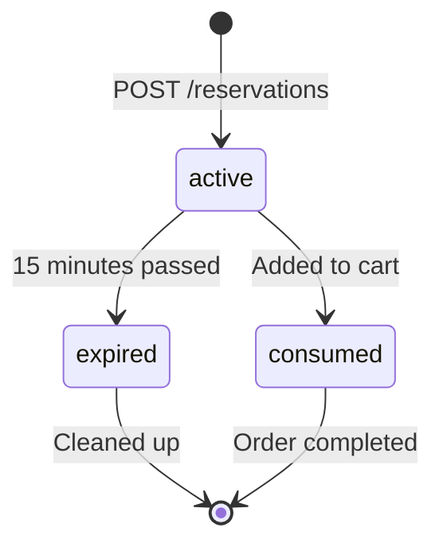

## Overview

Retrieves the details of an existing reservation by its unique identifier. This endpoint is useful for checking the status of a reservation, verifying expiration times, and validating reservation data before adding seats to a cart.

<Note>
  This endpoint is currently **not implemented** in the Inventory service source code. The documentation below describes the expected behavior based on the system architecture and the FRONTEND_API_GUIDE.md workflow.
</Note>

<Info>
  **Alternative approach**: Instead of querying the Inventory service directly, most workflows rely on the `reservationId` returned from the `POST /reservations` endpoint and pass it to the Ordering service via `POST /cart/add`. The Ordering service receives reservation details through Kafka events.
</Info>

## Request

### Path Parameters

<ParamField path="id" type="string" required>
  The unique reservation identifier (UUID format)
  
  Example: `"8bf7fffc-9ff5-401c-9d2d-86f525f42e40"`
</ParamField>

### Headers

```http
Accept: application/json
```

## Response

<ResponseField name="reservationId" type="string">
  Unique identifier for the reservation (UUID format)
</ResponseField>

<ResponseField name="seatId" type="string">
  UUID of the reserved seat
</ResponseField>

<ResponseField name="customerId" type="string">
  Customer identifier who made the reservation
</ResponseField>

<ResponseField name="createdAt" type="string">
  ISO 8601 timestamp when the reservation was created
  
  Example: `"2026-02-24T15:45:00Z"`
</ResponseField>

<ResponseField name="expiresAt" type="string">
  ISO 8601 timestamp when the reservation expires (15 minutes from creation)
  
  Example: `"2026-02-24T16:00:00Z"`
</ResponseField>

<ResponseField name="status" type="string">
  Current status of the reservation
  
  Possible values:
  - `"active"` - Reservation is valid and can be used
  - `"expired"` - Reservation has passed its expiration time
  - `"consumed"` - Reservation was successfully used in an order
</ResponseField>

## Example Request

<CodeGroup>
```bash cURL
curl -X GET http://localhost:50002/reservations/8bf7fffc-9ff5-401c-9d2d-86f525f42e40 \
  -H "Accept: application/json"
```

```javascript JavaScript
async function getReservation(reservationId) {
  const response = await fetch(
    `http://localhost:50002/reservations/${reservationId}`,
    {
      headers: { 'Accept': 'application/json' }
    }
  );
  
  if (!response.ok) {
    const error = await response.json();
    throw new Error(error.error || 'Failed to retrieve reservation');
  }
  
  return response.json();
}

// Usage
const reservation = await getReservation(
  '8bf7fffc-9ff5-401c-9d2d-86f525f42e40'
);

// Check if reservation is still active
const now = new Date();
const expiresAt = new Date(reservation.expiresAt);
const isExpired = now > expiresAt;

console.log('Status:', reservation.status);
console.log('Is Expired:', isExpired);
```

```python Python
import requests
from datetime import datetime

def get_reservation(reservation_id):
    """Retrieve a reservation by ID"""
    url = f"http://localhost:50002/reservations/{reservation_id}"
    response = requests.get(url)
    response.raise_for_status()
    return response.json()

# Usage
reservation = get_reservation("8bf7fffc-9ff5-401c-9d2d-86f525f42e40")

# Check expiration
expires_at = datetime.fromisoformat(
    reservation['expiresAt'].replace('Z', '+00:00')
)
is_expired = datetime.now(expires_at.tzinfo) > expires_at

print(f"Reservation ID: {reservation['reservationId']}")
print(f"Status: {reservation['status']}")
print(f"Expired: {is_expired}")
```
</CodeGroup>

## Example Response

<ResponseExample>
```json 200 OK - Active Reservation
{
  "reservationId": "8bf7fffc-9ff5-401c-9d2d-86f525f42e40",
  "seatId": "550e8400-e29b-41d4-a716-446655440002",
  "customerId": "customer-123",
  "createdAt": "2026-02-24T15:45:00Z",
  "expiresAt": "2026-02-24T16:00:00Z",
  "status": "active"
}
```

```json 200 OK - Expired Reservation
{
  "reservationId": "8bf7fffc-9ff5-401c-9d2d-86f525f42e40",
  "seatId": "550e8400-e29b-41d4-a716-446655440002",
  "customerId": "customer-123",
  "createdAt": "2026-02-24T15:30:00Z",
  "expiresAt": "2026-02-24T15:45:00Z",
  "status": "expired"
}
```

```json 404 Not Found
{
  "error": "Reservation 8bf7fffc-9ff5-401c-9d2d-86f525f42e40 not found"
}
```

```json 400 Bad Request - Invalid ID format
{
  "error": "Invalid reservation ID format"
}
```
</ResponseExample>

## Error Responses

### 400 Bad Request

Returned when the reservation ID is not in valid UUID format.

### 404 Not Found

Returned when the reservation ID doesn't exist in the database. This can happen if:

- The reservation ID is invalid
- The reservation was deleted from the system
- The ID belongs to a different customer (if customer authorization is implemented)

### 500 Internal Server Error

Returned for unexpected server errors such as database connection failures.

## Implementation Status

<Warning>
  **Not Yet Implemented**: This endpoint does not currently exist in the Inventory service codebase. Based on the source code analysis:
  
  - `ReservationEndpoints.cs` only implements `POST /reservations`
  - No GET endpoint or query handler exists in the application layer
  - The current workflow assumes clients store the `reservationId` from the creation response
</Warning>

### Current Workflow

The existing implementation expects clients to:

1. Call `POST /reservations` and store the returned `reservationId`
2. Wait 2-3 seconds for Kafka event processing
3. Pass the `reservationId` directly to `POST /cart/add`

The Ordering service receives full reservation details through the `reservation-created` Kafka event, eliminating the need to query the Inventory service.

### If Implementation Is Needed

To implement this endpoint, the following changes would be required:

<Steps>
  <Step title="Create Query Handler">
    Add `GetReservationQuery` and `GetReservationQueryHandler` in the Application layer
  </Step>
  
  <Step title="Map Endpoint">
    Add `MapGet("/{id}", GetReservation)` in `ReservationEndpoints.cs`
  </Step>
  
  <Step title="Add Response DTO">
    Define `GetReservationResponse` in `ReservationDtos.cs` (or reuse `CreateReservationResponse`)
  </Step>
  
  <Step title="Implement Handler Logic">
    Query the database for the reservation by ID and map to response DTO
  </Step>
</Steps>

## Expected Source Code Locations

If this endpoint were to be implemented:

- **Endpoint**: `Inventory.Api/Endpoints/ReservationEndpoints.cs` (add GET mapping)
- **Query**: `Inventory.Application/UseCases/GetReservation/GetReservationQuery.cs` (new)
- **Handler**: `Inventory.Application/UseCases/GetReservation/GetReservationQueryHandler.cs` (new)
- **Domain Model**: `Inventory.Domain/Entities/Reservation.cs` (exists)

## Alternative: Query via Ordering Service

<Info>
  Since the Ordering service maintains reservation data received through Kafka events, you may be able to query reservation status through the Ordering service instead. Check the Ordering API documentation for available endpoints.
</Info>

## Use Cases

Even though this endpoint is not currently implemented, it would be useful for:

- **Checking expiration status** before attempting to add to cart
- **Validating reservation ownership** (ensure the customer ID matches)
- **Admin dashboards** to view active/expired reservations
- **Customer support** to troubleshoot reservation issues
- **Retry logic** to check if a previous reservation is still valid

## Reservation Lifecycle

Understanding the reservation lifecycle helps explain when and why you might query a reservation:



- **active**: Reservation is valid and can be added to cart
- **expired**: Reservation exceeded 15-minute TTL
- **consumed**: Reservation was successfully used in an order

## Related Endpoints

- [Create Reservation](/api/inventory/create-reservation) - Create a new seat reservation
- [Add to Cart](/api/ordering/add-to-cart) - Add a reserved seat to cart (requires waiting 2-3 seconds after reservation)
