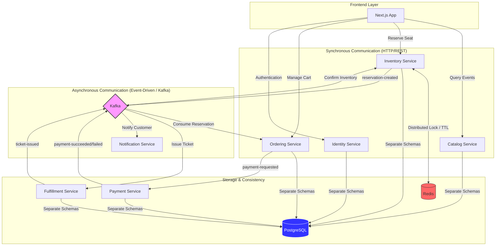
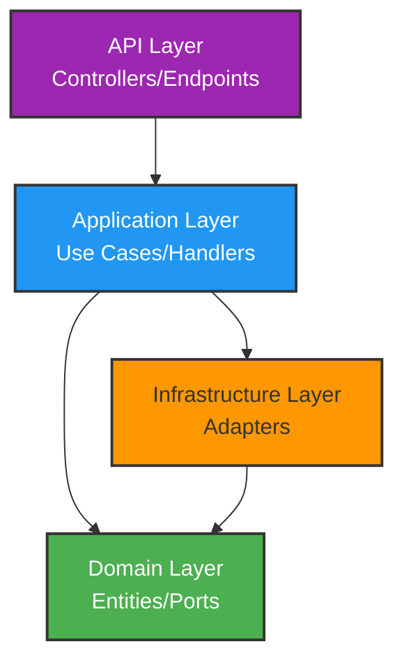

# System Architecture Overview

SpecKit Ticketing Platform is built on a **distributed microservices architecture** that combines **Hexagonal Architecture** (Ports & Adapters), **CQRS**, and **Event-Driven Design** to create a scalable, maintainable ticketing system.

## Architecture Diagram



## Core Architectural Principles

<Accordion title="1. Hexagonal Architecture (Ports & Adapters)">

Each microservice is structured using hexagonal architecture, which isolates the domain logic from infrastructure concerns.

**Structure:**

```
service/
├── Domain/           # Business logic & entities
│   ├── Entities/     # Domain models
│   └── Ports/        # Interfaces (abstractions)
├── Application/      # Use cases & orchestration
│   ├── UseCases/     # Command/Query handlers
│   └── Ports/        # Application-level interfaces
├── Infrastructure/   # External adapters
│   ├── Persistence/  # Database implementation
│   ├── Messaging/    # Kafka producers/consumers
│   └── Locking/      # Redis lock implementation
└── Api/              # HTTP endpoints
```

**Key Benefits:**
- Domain logic remains pure and testable
- Easy to swap infrastructure implementations
- Clear separation of concerns
- Dependency inversion: Domain depends on abstractions, not implementations

</Accordion>

<Accordion title="2. Bounded Contexts">

The system is divided into distinct bounded contexts, each owning its data and business logic:

| Bounded Context | Responsibility | Key Entities |
|-----------------|----------------|---------------|
| **Catalog** | Event browsing, seat information | Event, Seat |
| **Inventory** | Seat reservations, availability | Reservation, Seat |
| **Ordering** | Shopping cart, order management | Order, OrderItem |
| **Payment** | Payment processing, validation | Payment, Transaction |
| **Fulfillment** | Ticket generation, delivery | Ticket |
| **Identity** | User authentication, authorization | User, Token |
| **Notification** | Email notifications | EmailNotification |

**Context Independence:**
- Each context has its own database schema (e.g., `bc_catalog`, `bc_inventory`)
- Services communicate via well-defined contracts
- No direct database sharing between contexts

</Accordion>

<Accordion title="3. Service Layers">

Each microservice follows a consistent layering strategy:



**Layer Responsibilities:**

<Tabs>
  <Tab title="API Layer">
    **Role:** HTTP endpoints and request/response handling
    
    ```csharp
    // services/ordering/src/Api/Controllers/CartController.cs
    [ApiController]
    [Route("api/[controller]")]
    public class CartController : ControllerBase
    {
        private readonly IMediator _mediator;

        [HttpPost("add")]
        public async Task<IActionResult> AddToCart(
            [FromBody] AddToCartRequest request)
        {
            var command = new AddToCartCommand(
                request.SeatId, 
                request.UserId, 
                request.GuestToken
            );
            
            var result = await _mediator.Send(command);
            return Ok(result);
        }
    }
    ```
  </Tab>
  
  <Tab title="Application Layer">
    **Role:** Use case orchestration with MediatR handlers
    
    ```csharp
    // services/ordering/src/Application/UseCases/AddToCart/AddToCartHandler.cs
    public class AddToCartHandler : IRequestHandler<AddToCartCommand, AddToCartResponse>
    {
        private readonly IOrderRepository _orderRepository;
        private readonly ReservationStore _reservationStore;

        public async Task<AddToCartResponse> Handle(
            AddToCartCommand request, 
            CancellationToken cancellationToken)
        {
            // Business logic orchestration
            var reservation = _reservationStore.GetReservation(request.SeatId);
            var order = await GetOrCreateDraftOrder(request);
            
            order.AddItem(reservation);
            await _orderRepository.UpdateAsync(order);
            
            return new AddToCartResponse(order.Id);
        }
    }
    ```
  </Tab>
  
  <Tab title="Domain Layer">
    **Role:** Business entities and rules
    
    ```csharp
    // services/ordering/src/Domain/Entities/Order.cs
    public class Order
    {
        public Guid Id { get; set; }
        public string State { get; set; } = "draft";
        public List<OrderItem> Items { get; set; } = new();
        public decimal TotalAmount => Items.Sum(i => i.Price);

        public void AddItem(ReservationCreatedEvent reservation)
        {
            if (State != "draft")
                throw new InvalidOperationException(
                    "Cannot add items to non-draft order"
                );
            
            Items.Add(new OrderItem
            {
                SeatId = reservation.SeatId,
                Price = reservation.BasePrice
            });
        }
    }
    ```
  </Tab>
  
  <Tab title="Infrastructure Layer">
    **Role:** External system integration
    
    ```csharp
    // services/ordering/src/Infrastructure/Persistence/OrderRepository.cs
    public class OrderRepository : IOrderRepository
    {
        private readonly OrderingDbContext _context;

        public async Task<Order?> GetByIdAsync(
            Guid orderId, 
            CancellationToken cancellationToken = default)
        {
            return await _context.Orders
                .Include(o => o.Items)
                .FirstOrDefaultAsync(o => o.Id == orderId, cancellationToken);
        }

        public async Task<Order> UpdateAsync(
            Order order, 
            CancellationToken cancellationToken = default)
        {
            _context.Orders.Update(order);
            await _context.SaveChangesAsync(cancellationToken);
            return order;
        }
    }
    ```
  </Tab>
</Tabs>

</Accordion>

## Communication Patterns

<CardGroup cols={2}>
  <Card title="Synchronous (REST)" icon="bolt">
    **When to Use:**
    - Immediate queries (browsing events)
    - Real-time validation (seat availability)
    - User-initiated actions requiring instant feedback
    
    **Examples:**
    - `GET /api/events` → Catalog Service
    - `POST /api/reservations` → Inventory Service
    - `POST /api/cart/add` → Ordering Service
  </Card>
  
  <Card title="Asynchronous (Kafka)" icon="paper-plane">
    **When to Use:**
    - Long-running workflows (payment processing)
    - Event choreography across services
    - Eventual consistency scenarios
    
    **Examples:**
    - `reservation-created` event triggers order creation
    - `payment-succeeded` event triggers ticket fulfillment
    - `ticket-issued` event triggers notification
  </Card>
</CardGroup>

## Data Consistency Strategy

<Tabs>
  <Tab title="Strong Consistency">
    **Used for:** Critical operations within a bounded context
    
    **Implementation:**
    - PostgreSQL transactions with ACID guarantees
    - Unit of Work pattern via EF Core's `SaveChangesAsync()`
    - Redis distributed locks for cross-instance coordination
    
    **Example:**
    ```csharp
    // Atomic seat reservation with distributed lock
    var lockToken = await _redisLock.AcquireLockAsync(lockKey, ttl);
    try
    {
        seat.Reserved = true;
        _context.Reservations.Add(reservation);
        await _context.SaveChangesAsync(); // Atomic transaction
    }
    finally
    {
        await _redisLock.ReleaseLockAsync(lockKey, lockToken);
    }
    ```
  </Tab>
  
  <Tab title="Eventual Consistency">
    **Used for:** Cross-service workflows and reporting
    
    **Implementation:**
    - Kafka event streams with idempotent consumers
    - In-memory stores for read models (e.g., `ReservationStore`)
    - Background workers for synchronization
    
    **Example:**
    ```csharp
    // Ordering service eventually learns about reservations
    public class ReservationEventConsumer : BackgroundService
    {
        protected override async Task ExecuteAsync(
            CancellationToken stoppingToken)
        {
            consumer.Subscribe(new[] { "reservation-created" });
            
            while (!stoppingToken.IsCancellationRequested)
            {
                var message = consumer.Consume(stoppingToken);
                var @event = Deserialize<ReservationCreatedEvent>(message);
                
                // Update local read model
                _reservationStore.AddReservation(@event);
            }
        }
    }
    ```
  </Tab>
</Tabs>

## Technology Stack

| Component | Technology | Purpose |
|-----------|------------|----------|
| **Backend** | .NET 9, Minimal APIs | High-performance microservices |
| **Messaging** | MediatR | In-process command/query handling |
| **ORM** | Entity Framework Core | Database access with migrations |
| **Event Bus** | Apache Kafka | Asynchronous event choreography |
| **Caching/Locking** | Redis | Distributed locks, session state |
| **Database** | PostgreSQL | Persistent data storage (schema-per-service) |
| **Observability** | OpenTelemetry, Serilog | Distributed tracing and logging |
| **Frontend** | Next.js 14, TailwindCSS | Modern React-based UI |

## Key Design Decisions

<Accordion title="Why Hexagonal Architecture?">

**Benefits Realized:**

1. **Testability:** Domain logic can be tested without infrastructure
   ```csharp
   // Pure unit test without database or Kafka
   var mockRedisLock = new MockRedisLock(acquireResult: "token-123");
   var mockKafka = new MockKafkaProducer();
   var handler = new CreateReservationCommandHandler(
       context, mockRedisLock, mockKafka
   );
   ```

2. **Flexibility:** Easy to swap implementations
   - Production: `RedisLock` → StackExchange.Redis
   - Testing: `MockRedisLock` → In-memory simulation

3. **Clear Boundaries:** Domain never references infrastructure types
   ```csharp
   // Domain port (interface)
   public interface IRedisLock
   {
       Task<string?> AcquireLockAsync(string key, TimeSpan ttl);
   }
   
   // Infrastructure adapter
   public class RedisLock : IRedisLock { /* Redis-specific code */ }
   ```

</Accordion>

<Accordion title="Why Separate Database Schemas?">

**Rationale:**

- **Bounded Context Isolation:** Each service owns its schema (`bc_inventory`, `bc_ordering`)
- **Independent Deployment:** Schema migrations don't affect other services
- **Data Integrity:** No cross-schema foreign keys prevent accidental coupling
- **Future-Proof:** Easy to split into separate databases if needed

```sql
-- Each service creates its own schema
CREATE SCHEMA IF NOT EXISTS bc_inventory;
CREATE SCHEMA IF NOT EXISTS bc_ordering;
CREATE SCHEMA IF NOT EXISTS bc_catalog;
```

</Accordion>

<Accordion title="Why Hybrid Sync/Async Communication?">

**Synchronous REST** is used when:
- User expects immediate feedback (seat availability check)
- Operation is simple and fast (query events)
- Strong consistency is required within a single context

**Asynchronous Kafka** is used when:
- Operation involves multiple services (checkout → payment → fulfillment)
- Process is long-running (payment gateway integration)
- Services should remain decoupled (notification doesn't block fulfillment)

**Example Workflow:**
```
1. User reserves seat (Sync REST)  → Immediate response
2. Inventory publishes event (Async) → Ordering service reacts
3. User checks out (Sync REST)     → Order created
4. Payment processed (Async)       → Payment service handles
5. Ticket issued (Async)           → Fulfillment service generates
6. Email sent (Async)              → Notification service delivers
```

</Accordion>

## Related Concepts

<CardGroup cols={2}>
  <Card title="Microservices Design" href="/concepts/microservices" icon="server">
    Learn about service boundaries, independence, and deployment strategies
  </Card>
  
  <Card title="Event-Driven Architecture" href="/concepts/event-driven" icon="bolt">
    Deep dive into Kafka events, async workflows, and choreography
  </Card>
  
  <Card title="CQRS Pattern" href="/concepts/cqrs" icon="split">
    Understand command/query separation with MediatR
  </Card>
  
  <Card title="Hexagonal Architecture" href="/concepts/hexagonal-architecture" icon="hexagon">
    Detailed exploration of ports, adapters, and dependency inversion
  </Card>
</CardGroup>