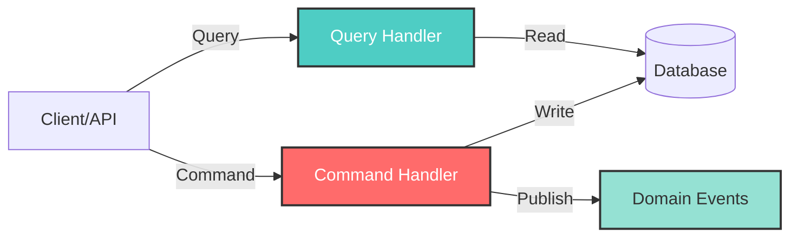

# CQRS Pattern

**Command Query Responsibility Segregation (CQRS)** is a pattern that separates read operations (Queries) from write operations (Commands). SpecKit implements CQRS using **MediatR** to achieve clean separation of concerns and improved testability.

## CQRS Overview



<CardGroup cols={2}>
  <Card title="Commands" icon="pen-to-square">
    **Purpose:** Modify system state
    
    **Characteristics:**
    - Task-based (imperative)
    - Can fail with business rule violations
    - May publish domain events
    - Should be validated
    - Return confirmation/result
    
    **Examples:**
    - `CreateReservationCommand`
    - `AddToCartCommand`
    - `CheckoutOrderCommand`
  </Card>
  
  <Card title="Queries" icon="magnifying-glass">
    **Purpose:** Retrieve data without side effects
    
    **Characteristics:**
    - Read-only operations
    - Never modify state
    - Can be cached
    - Optimized for specific views
    - Always succeed (or return empty)
    
    **Examples:**
    - `GetAllEventsQuery`
    - `GetEventSeatmapQuery`
    - `GetOrderQuery`
  </Card>
</CardGroup>

## MediatR Implementation

### Setup & Registration

<Accordion title="Install MediatR">

```xml
<!-- services/inventory/src/Inventory.Application/Inventory.Application.csproj -->
<PackageReference Include="MediatR" Version="12.0.0" />
<PackageReference Include="MediatR.Extensions.Microsoft.DependencyInjection" Version="11.1.0" />
```

```csharp
// services/inventory/src/Api/Program.cs
var builder = WebApplication.CreateBuilder(args);

// Register MediatR with all handlers in Application assembly
builder.Services.AddMediatR(cfg => 
    cfg.RegisterServicesFromAssembly(
        typeof(CreateReservationCommand).Assembly
    )
);

builder.Services.AddInfrastructure(builder.Configuration);

var app = builder.Build();
```

**What This Does:**
- Scans `Inventory.Application` assembly for handlers
- Registers all `IRequestHandler<TRequest, TResponse>` implementations
- Enables dependency injection of `IMediator`

</Accordion>

## Commands in Detail

<Tabs>
  <Tab title="Command Definition">
    Commands are immutable records that implement `IRequest<TResponse>`:
    
    ```csharp
    // services/inventory/src/Application/UseCases/CreateReservation/CreateReservationCommand.cs
    using MediatR;
    using Inventory.Application.DTOs;
    
    namespace Inventory.Application.UseCases.CreateReservation;
    
    /// <summary>
    /// Command to create a seat reservation with distributed locking.
    /// </summary>
    public record CreateReservationCommand(
        Guid SeatId,
        string CustomerId
    ) : IRequest<CreateReservationResponse>;
    
    /// <summary>
    /// Response containing the created reservation details.
    /// </summary>
    public record CreateReservationResponse(
        Guid ReservationId,
        Guid SeatId,
        string CustomerId,
        DateTime ExpiresAt,
        string Status
    );
    ```
    
    **Design Principles:**
    - Use `record` for immutability
    - Include all required data in constructor
    - Explicit response type for type safety
    - Self-documenting with XML comments
  </Tab>
  
  <Tab title="Command Handler">
    Handlers implement `IRequestHandler<TRequest, TResponse>`:
    
    ```csharp
    // services/inventory/src/Application/UseCases/CreateReservation/CreateReservationCommandHandler.cs
    using MediatR;
    using Inventory.Domain.Entities;
    using Inventory.Domain.Ports;
    using Inventory.Infrastructure.Persistence;
    
    public class CreateReservationCommandHandler 
        : IRequestHandler<CreateReservationCommand, CreateReservationResponse>
    {
        private readonly InventoryDbContext _context;
        private readonly IRedisLock _redisLock;
        private readonly IKafkaProducer _kafkaProducer;
    
        private const string RedisLockKeyPrefix = "lock:seat:";
        private const int LockExpirySeconds = 30;
        private const int ReservationTTLMinutes = 15;
    
        public CreateReservationCommandHandler(
            InventoryDbContext context,
            IRedisLock redisLock,
            IKafkaProducer kafkaProducer)
        {
            _context = context ?? throw new ArgumentNullException(nameof(context));
            _redisLock = redisLock ?? throw new ArgumentNullException(nameof(redisLock));
            _kafkaProducer = kafkaProducer ?? throw new ArgumentNullException(nameof(kafkaProducer));
        }
    
        public async Task<CreateReservationResponse> Handle(
            CreateReservationCommand request,
            CancellationToken cancellationToken)
        {
            // Validation
            if (request.SeatId == Guid.Empty)
                throw new ArgumentException("SeatId cannot be empty");
            if (string.IsNullOrEmpty(request.CustomerId))
                throw new ArgumentException("CustomerId cannot be empty");
    
            // Acquire distributed lock
            var lockKey = $"{RedisLockKeyPrefix}{request.SeatId:N}";
            var lockToken = await _redisLock.AcquireLockAsync(
                lockKey, 
                TimeSpan.FromSeconds(LockExpirySeconds)
            );
    
            if (lockToken is null)
            {
                throw new InvalidOperationException(
                    $"Could not acquire lock for seat {request.SeatId}"
                );
            }
    
            try
            {
                // Fetch and validate seat
                var seat = await _context.Seats.FindAsync(
                    [request.SeatId], 
                    cancellationToken: cancellationToken
                );
    
                if (seat is null)
                    throw new KeyNotFoundException(
                        $"Seat {request.SeatId} not found"
                    );
    
                if (seat.Reserved)
                    throw new InvalidOperationException(
                        $"Seat {request.SeatId} is already reserved"
                    );
    
                // Create reservation entity
                var now = DateTime.UtcNow;
                var reservation = new Reservation
                {
                    Id = Guid.NewGuid(),
                    SeatId = request.SeatId,
                    CustomerId = request.CustomerId,
                    CreatedAt = now,
                    ExpiresAt = now.AddMinutes(ReservationTTLMinutes),
                    Status = "active"
                };
    
                // Update seat state
                seat.Reserved = true;
    
                // Persist changes (Unit of Work)
                _context.Reservations.Add(reservation);
                _context.Seats.Update(seat);
                await _context.SaveChangesAsync(cancellationToken);
    
                // Publish domain event
                await PublishReservationCreatedEvent(
                    reservation, 
                    seat, 
                    cancellationToken
                );
    
                // Return response
                return new CreateReservationResponse(
                    ReservationId: reservation.Id,
                    SeatId: reservation.SeatId,
                    CustomerId: reservation.CustomerId,
                    ExpiresAt: reservation.ExpiresAt,
                    Status: reservation.Status
                );
            }
            finally
            {
                // Always release the lock
                await _redisLock.ReleaseLockAsync(lockKey, lockToken);
            }
        }
    
        private async Task PublishReservationCreatedEvent(
            Reservation reservation,
            Seat seat,
            CancellationToken cancellationToken)
        {
            var @event = new ReservationCreatedEvent(
                EventId: Guid.NewGuid().ToString("D"),
                ReservationId: reservation.Id.ToString("D"),
                CustomerId: reservation.CustomerId,
                SeatId: reservation.SeatId.ToString("D"),
                SeatNumber: $"{seat.Section}-{seat.Row}-{seat.Number}",
                Section: seat.Section,
                BasePrice: 0m,
                CreatedAt: reservation.CreatedAt,
                ExpiresAt: reservation.ExpiresAt,
                Status: reservation.Status
            );
    
            var json = JsonSerializer.Serialize(@event);
            await _kafkaProducer.ProduceAsync(
                "reservation-created",
                json,
                reservation.SeatId.ToString("N")
            );
        }
    }
    ```
    
    **Handler Responsibilities:**
    1. **Validate** input parameters
    2. **Acquire** distributed lock (if needed)
    3. **Fetch** required entities
    4. **Apply** business rules
    5. **Persist** state changes
    6. **Publish** domain events
    7. **Return** response
  </Tab>
  
  <Tab title="API Integration">
    Controllers/Endpoints send commands via IMediator:
    
    ```csharp
    // services/inventory/src/Api/Endpoints/ReservationEndpoints.cs
    public static class ReservationEndpoints
    {
        public static void MapReservationEndpoints(this IEndpointRouteBuilder app)
        {
            app.MapPost("/api/reservations", CreateReservation)
                .WithName("CreateReservation")
                .WithOpenApi();
        }
    
        private static async Task<IResult> CreateReservation(
            [FromBody] CreateReservationRequest request,
            [FromServices] IMediator mediator,
            CancellationToken cancellationToken)
        {
            try
            {
                // Create command from request
                var command = new CreateReservationCommand(
                    request.SeatId,
                    request.CustomerId
                );
    
                // Send command to handler via MediatR
                var response = await mediator.Send(command, cancellationToken);
    
                return Results.Ok(response);
            }
            catch (KeyNotFoundException ex)
            {
                return Results.NotFound(new { error = ex.Message });
            }
            catch (InvalidOperationException ex)
            {
                return Results.BadRequest(new { error = ex.Message });
            }
        }
    }
    ```
    
    **Separation Benefits:**
    - API layer handles HTTP concerns only
    - Business logic stays in handler
    - Easy to add GraphQL, gRPC, or other interfaces
  </Tab>
</Tabs>

## Queries in Detail

<Tabs>
  <Tab title="Query Definition">
    Queries request data without modifying state:
    
    ```csharp
    // services/catalog/src/Application/UseCases/GetAllEvents/GetAllEventsQuery.cs
    using MediatR;
    
    namespace Catalog.Application.UseCases.GetAllEvents;
    
    /// <summary>
    /// Query to retrieve all available events.
    /// </summary>
    public record GetAllEventsQuery : IRequest<GetAllEventsResponse>;
    
    /// <summary>
    /// Response containing the list of events.
    /// </summary>
    public record GetAllEventsResponse(
        IEnumerable<EventDto> Events
    );
    
    public record EventDto
    {
        public Guid Id { get; init; }
        public string Name { get; init; } = string.Empty;
        public DateTime Date { get; init; }
        public string Location { get; init; } = string.Empty;
        public string Description { get; init; } = string.Empty;
        public int TotalSeats { get; init; }
        public int AvailableSeats { get; init; }
    }
    ```
    
    **Query with Parameters:**
    
    ```csharp
    // services/catalog/src/Application/UseCases/GetEventSeatmap/GetEventSeatmapQuery.cs
    public record GetEventSeatmapQuery(Guid EventId) 
        : IRequest<GetEventSeatmapResponse>;
    
    public record GetEventSeatmapResponse(
        Guid EventId,
        string EventName,
        IEnumerable<SeatDto> Seats
    );
    
    public record SeatDto
    {
        public Guid Id { get; init; }
        public string Section { get; init; } = string.Empty;
        public string Row { get; init; } = string.Empty;
        public string Number { get; init; } = string.Empty;
        public bool Reserved { get; init; }
        public string? CurrentReservationId { get; init; }
    }
    ```
  </Tab>
  
  <Tab title="Query Handler">
    Query handlers fetch and project data:
    
    ```csharp
    // services/catalog/src/Application/UseCases/GetAllEvents/GetAllEventsHandler.cs
    using MediatR;
    using Catalog.Application.Ports;
    
    public class GetAllEventsHandler 
        : IRequestHandler<GetAllEventsQuery, GetAllEventsResponse>
    {
        private readonly ICatalogRepository _repository;
    
        public GetAllEventsHandler(ICatalogRepository repository)
        {
            _repository = repository;
        }
    
        public async Task<GetAllEventsResponse> Handle(
            GetAllEventsQuery request,
            CancellationToken cancellationToken)
        {
            // Fetch all events
            var events = await _repository.GetAllEventsAsync(cancellationToken);
    
            // Project to DTOs
            var eventDtos = events.Select(e => new EventDto
            {
                Id = e.Id,
                Name = e.Name,
                Date = e.Date,
                Location = e.Location,
                Description = e.Description,
                TotalSeats = e.TotalSeats,
                AvailableSeats = e.AvailableSeats
            });
    
            return new GetAllEventsResponse(eventDtos);
        }
    }
    ```
    
    **Query with Complex Projections:**
    
    ```csharp
    // services/catalog/src/Application/UseCases/GetEventSeatmap/GetEventSeatmapHandler.cs
    public class GetEventSeatmapHandler 
        : IRequestHandler<GetEventSeatmapQuery, GetEventSeatmapResponse>
    {
        private readonly ICatalogRepository _repository;
    
        public async Task<GetEventSeatmapResponse> Handle(
            GetEventSeatmapQuery request,
            CancellationToken cancellationToken)
        {
            // Fetch event with seats
            var eventEntity = await _repository.GetEventByIdAsync(
                request.EventId, 
                cancellationToken
            );
    
            if (eventEntity is null)
                throw new KeyNotFoundException(
                    $"Event {request.EventId} not found"
                );
    
            var seats = await _repository.GetSeatsByEventIdAsync(
                request.EventId,
                cancellationToken
            );
    
            // Project seats to DTOs with reservation status
            var seatDtos = seats.Select(s => new SeatDto
            {
                Id = s.Id,
                Section = s.Section,
                Row = s.Row,
                Number = s.Number,
                Reserved = s.Reserved,
                CurrentReservationId = s.CurrentReservationId
            });
    
            return new GetEventSeatmapResponse(
                EventId: eventEntity.Id,
                EventName: eventEntity.Name,
                Seats: seatDtos
            );
        }
    }
    ```
  </Tab>
  
  <Tab title="API Integration">
    Queries are sent via minimal APIs or controllers:
    
    ```csharp
    // services/catalog/src/Api/Controllers/EventsController.cs
    [ApiController]
    [Route("api/[controller]")]
    public class EventsController : ControllerBase
    {
        private readonly IMediator _mediator;
    
        public EventsController(IMediator mediator)
        {
            _mediator = mediator;
        }
    
        [HttpGet]
        public async Task<IActionResult> GetAllEvents(
            CancellationToken cancellationToken)
        {
            var query = new GetAllEventsQuery();
            var response = await _mediator.Send(query, cancellationToken);
            return Ok(response);
        }
    
        [HttpGet("{eventId}/seatmap")]
        public async Task<IActionResult> GetEventSeatmap(
            Guid eventId,
            CancellationToken cancellationToken)
        {
            try
            {
                var query = new GetEventSeatmapQuery(eventId);
                var response = await _mediator.Send(query, cancellationToken);
                return Ok(response);
            }
            catch (KeyNotFoundException ex)
            {
                return NotFound(new { error = ex.Message });
            }
        }
    }
    ```
  </Tab>
</Tabs>

## Complete Service Examples

<Accordion title="Ordering Service: AddToCart Command">

```csharp
// services/ordering/src/Application/UseCases/AddToCart/AddToCartCommand.cs
public record AddToCartCommand(
    string SeatId,
    string? UserId,
    string? GuestToken
) : IRequest<AddToCartResponse>;

public record AddToCartResponse(
    Guid OrderId,
    string State,
    IEnumerable<OrderItemDto> Items,
    decimal TotalAmount
);
```

```csharp
// services/ordering/src/Application/UseCases/AddToCart/AddToCartHandler.cs
public class AddToCartHandler 
    : IRequestHandler<AddToCartCommand, AddToCartResponse>
{
    private readonly IOrderRepository _orderRepository;
    private readonly ReservationStore _reservationStore;

    public async Task<AddToCartResponse> Handle(
        AddToCartCommand request,
        CancellationToken cancellationToken)
    {
        // Validate reservation exists
        var reservation = _reservationStore.GetReservation(request.SeatId);
        if (reservation == null)
        {
            throw new InvalidOperationException(
                "No active reservation found for this seat"
            );
        }

        // Get or create draft order
        var order = await _orderRepository.GetDraftOrderAsync(
            request.UserId,
            request.GuestToken,
            cancellationToken
        );

        if (order == null)
        {
            order = new Order
            {
                Id = Guid.NewGuid(),
                UserId = request.UserId,
                GuestToken = request.GuestToken,
                State = "draft",
                CreatedAt = DateTime.UtcNow
            };
            await _orderRepository.CreateAsync(order, cancellationToken);
        }

        // Add item to order
        order.AddItem(reservation);
        await _orderRepository.UpdateAsync(order, cancellationToken);

        // Return response
        return new AddToCartResponse(
            OrderId: order.Id,
            State: order.State,
            Items: order.Items.Select(i => new OrderItemDto
            {
                SeatId = i.SeatId,
                SeatNumber = i.SeatNumber,
                Price = i.Price
            }),
            TotalAmount: order.TotalAmount
        );
    }
}
```

</Accordion>

<Accordion title="Ordering Service: CheckoutOrder Command">

```csharp
// services/ordering/src/Application/UseCases/CheckoutOrder/CheckoutOrderCommand.cs
public record CheckoutOrderCommand(
    Guid OrderId,
    string PaymentMethod,
    string? UserId,
    string? GuestToken
) : IRequest<CheckoutOrderResponse>;

public record CheckoutOrderResponse(
    Guid OrderId,
    string State,
    decimal TotalAmount,
    DateTime CheckedOutAt
);
```

```csharp
// services/ordering/src/Application/UseCases/CheckoutOrder/CheckoutOrderHandler.cs
public class CheckoutOrderHandler 
    : IRequestHandler<CheckoutOrderCommand, CheckoutOrderResponse>
{
    private readonly IOrderRepository _orderRepository;
    private readonly ReservationStore _reservationStore;

    public async Task<CheckoutOrderResponse> Handle(
        CheckoutOrderCommand request,
        CancellationToken cancellationToken)
    {
        // Fetch order
        var order = await _orderRepository.GetByIdAsync(
            request.OrderId,
            cancellationToken
        );

        if (order == null)
            throw new KeyNotFoundException($"Order {request.OrderId} not found");

        // Validate ownership
        if (order.UserId != request.UserId && 
            order.GuestToken != request.GuestToken)
        {
            throw new UnauthorizedAccessException(
                "Order does not belong to user"
            );
        }

        // Validate state
        if (order.State != "draft")
        {
            throw new InvalidOperationException(
                $"Cannot checkout order in state: {order.State}"
            );
        }

        // Validate all reservations still active
        foreach (var item in order.Items)
        {
            var reservation = _reservationStore.GetReservation(item.SeatId);
            if (reservation == null || reservation.Status != "active")
            {
                throw new InvalidOperationException(
                    $"Reservation for seat {item.SeatId} is no longer valid"
                );
            }
        }

        // Update order state
        order.State = "pending_payment";
        order.PaymentMethod = request.PaymentMethod;
        order.CheckedOutAt = DateTime.UtcNow;

        await _orderRepository.UpdateAsync(order, cancellationToken);

        return new CheckoutOrderResponse(
            OrderId: order.Id,
            State: order.State,
            TotalAmount: order.TotalAmount,
            CheckedOutAt: order.CheckedOutAt.Value
        );
    }
}
```

</Accordion>

## CQRS Benefits in SpecKit

<CardGroup cols={2}>
  <Card title="Separation of Concerns" icon="layer-group">
    **Commands:**
    - Complex validation logic
    - Distributed locking
    - Event publishing
    - Transaction management
    
    **Queries:**
    - Simple data retrieval
    - Optimized projections
    - No side effects
    - Cacheable
  </Card>
  
  <Card title="Independent Scaling" icon="chart-line">
    **Read vs Write Workloads:**
    
    - Catalog queries (high volume) can be cached
    - Reservation commands (write-heavy) use locks
    - Can use read replicas for queries
    - Commands remain on primary database
  </Card>
  
  <Card title="Testability" icon="vial">
    **Unit Testing:**
    
    ```csharp
    [Fact]
    public async Task Handle_ValidCommand_CreatesReservation()
    {
        // Arrange
        var mockRedisLock = new MockRedisLock("token-123");
        var mockKafka = new MockKafkaProducer();
        var handler = new CreateReservationCommandHandler(
            context, mockRedisLock, mockKafka
        );
        var command = new CreateReservationCommand(
            seatId, "customer-123"
        );
    
        // Act
        var response = await handler.Handle(command, CancellationToken.None);
    
        // Assert
        Assert.NotEqual(Guid.Empty, response.ReservationId);
        Assert.Equal("active", response.Status);
    }
    ```
  </Card>
  
  <Card title="Clear Intent" icon="book-open">
    **Task-Based Interface:**
    
    Instead of generic CRUD:
    ```csharp
    repository.Create(reservation);
    ```
    
    Use business-focused commands:
    ```csharp
    mediator.Send(new CreateReservationCommand(seatId, customerId));
    ```
    
    Makes code self-documenting and aligned with business operations.
  </Card>
</CardGroup>

## MediatR Pipeline Behaviors (Advanced)

<Accordion title="Cross-Cutting Concerns">

MediatR supports pipeline behaviors for cross-cutting concerns:

```csharp
// Logging behavior
public class LoggingBehavior<TRequest, TResponse> 
    : IPipelineBehavior<TRequest, TResponse>
    where TRequest : IRequest<TResponse>
{
    private readonly ILogger<LoggingBehavior<TRequest, TResponse>> _logger;

    public async Task<TResponse> Handle(
        TRequest request,
        RequestHandlerDelegate<TResponse> next,
        CancellationToken cancellationToken)
    {
        var requestName = typeof(TRequest).Name;
        
        _logger.LogInformation(
            "Handling {RequestName}: {@Request}",
            requestName,
            request
        );

        var response = await next();

        _logger.LogInformation(
            "Handled {RequestName}: {@Response}",
            requestName,
            response
        );

        return response;
    }
}
```

**Registration:**

```csharp
builder.Services.AddMediatR(cfg =>
{
    cfg.RegisterServicesFromAssembly(typeof(CreateReservationCommand).Assembly);
    cfg.AddBehavior(typeof(IPipelineBehavior<,>), typeof(LoggingBehavior<,>));
    cfg.AddBehavior(typeof(IPipelineBehavior<,>), typeof(ValidationBehavior<,>));
});
```

**Other Use Cases:**
- Validation (FluentValidation integration)
- Performance monitoring
- Transaction management
- Caching

</Accordion>

## CQRS vs Traditional Layered Architecture

<Tabs>
  <Tab title="Traditional (Repository Pattern)">
    ```csharp
    // Controller
    public class ReservationsController
    {
        private readonly IReservationRepository _repository;
        private readonly IRedisLock _lock;
        private readonly IKafkaProducer _kafka;
    
        [HttpPost]
        public async Task<IActionResult> Create(CreateReservationRequest request)
        {
            // All logic in controller
            var lockToken = await _lock.AcquireLockAsync(...);
            try
            {
                var seat = await _repository.GetSeatAsync(request.SeatId);
                if (seat.Reserved) return BadRequest();
                
                var reservation = new Reservation { ... };
                await _repository.AddAsync(reservation);
                await _kafka.ProduceAsync(...);
                
                return Ok(reservation);
            }
            finally
            {
                await _lock.ReleaseLockAsync(...);
            }
        }
    }
    ```
    
    **Problems:**
    - Business logic in controller
    - Hard to test (requires mocking HTTP context)
    - Difficult to reuse logic
  </Tab>
  
  <Tab title="CQRS with MediatR">
    ```csharp
    // Controller (thin)
    public class ReservationsController
    {
        private readonly IMediator _mediator;
    
        [HttpPost]
        public async Task<IActionResult> Create(
            CreateReservationRequest request)
        {
            var command = new CreateReservationCommand(
                request.SeatId,
                request.CustomerId
            );
            
            var response = await _mediator.Send(command);
            return Ok(response);
        }
    }
    
    // Handler (business logic)
    public class CreateReservationCommandHandler
        : IRequestHandler<CreateReservationCommand, CreateReservationResponse>
    {
        // All business logic here
        // Testable without HTTP
    }
    ```
    
    **Benefits:**
    - Controller is pure HTTP adapter
    - Handler contains all business logic
    - Easy to test handlers in isolation
    - Can invoke handlers from other contexts (background jobs, CLI, etc.)
  </Tab>
</Tabs>

## Related Concepts

<CardGroup cols={2}>
  <Card title="Event-Driven Architecture" href="/concepts/event-driven" icon="bolt">
    See how commands publish domain events
  </Card>
  
  <Card title="Hexagonal Architecture" href="/concepts/hexagonal-architecture" icon="hexagon">
    Understand how CQRS fits within ports & adapters
  </Card>
  
  <Card title="Microservices Design" href="/concepts/microservices" icon="server">
    Learn how each service implements CQRS
  </Card>
  
  <Card title="System Architecture" href="/concepts/architecture" icon="sitemap">
    View complete architecture overview
  </Card>
</CardGroup>