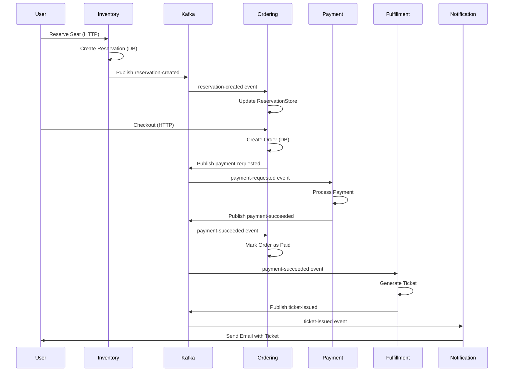

# Event-Driven Architecture

SpecKit uses **Apache Kafka** as its event bus to enable asynchronous communication between microservices. This event-driven approach allows services to react to state changes without tight coupling, enabling scalable and resilient workflows.

## Event Choreography Overview



## Kafka Topics & Events

<Tabs>
  <Tab title="reservation-created">
    **Producer:** Inventory Service  
    **Consumers:** Ordering Service, Catalog Service
    
    **Event Schema:**
    
    ```csharp
    public record ReservationCreatedEvent
    {
        [JsonPropertyName("eventId")]
        public string EventId { get; init; } = string.Empty;
        
        [JsonPropertyName("reservationId")]
        public string ReservationId { get; init; } = string.Empty;
        
        [JsonPropertyName("customerId")]
        public string? CustomerId { get; init; }
        
        [JsonPropertyName("seatId")]
        public string SeatId { get; init; } = string.Empty;
        
        [JsonPropertyName("seatNumber")]
        public string SeatNumber { get; init; } = string.Empty;
        
        [JsonPropertyName("section")]
        public string Section { get; init; } = string.Empty;
        
        [JsonPropertyName("basePrice")]
        public decimal BasePrice { get; init; }
        
        [JsonPropertyName("createdAt")]
        public DateTime CreatedAt { get; init; }
        
        [JsonPropertyName("expiresAt")]
        public DateTime ExpiresAt { get; init; }
        
        [JsonPropertyName("status")]
        public string Status { get; init; } = "active";
    }
    ```
    
    **Publishing Code:**
    
    ```csharp
    // services/inventory/src/Application/UseCases/CreateReservation/CreateReservationCommandHandler.cs
    private async Task PublishReservationCreatedEvent(
        Reservation reservation, 
        Seat seat, 
        CancellationToken cancellationToken)
    {
        var @event = new ReservationCreatedEvent(
            EventId: Guid.NewGuid().ToString("D"),
            ReservationId: reservation.Id.ToString("D"),
            CustomerId: reservation.CustomerId,
            SeatId: reservation.SeatId.ToString("D"),
            SeatNumber: $"{seat.Section}-{seat.Row}-{seat.Number}",
            Section: seat.Section,
            BasePrice: 0m,
            CreatedAt: reservation.CreatedAt,
            ExpiresAt: reservation.ExpiresAt,
            Status: reservation.Status
        );

        var json = JsonSerializer.Serialize(@event, _jsonOptions);
        await _kafkaProducer.ProduceAsync(
            "reservation-created", 
            json, 
            reservation.SeatId.ToString("N")
        );
    }
    ```
    
    **Use Case:**
    - Notify other services that a seat has been reserved
    - Ordering service adds reservation to cart
    - Catalog service updates seat availability display
  </Tab>
  
  <Tab title="reservation-expired">
    **Producer:** Inventory Service (Background Worker)  
    **Consumers:** Ordering Service, Catalog Service
    
    **Event Schema:**
    
    ```csharp
    public record ReservationExpiredEvent
    {
        [JsonPropertyName("reservationId")]
        public string ReservationId { get; init; } = string.Empty;
        
        [JsonPropertyName("seatId")]
        public string SeatId { get; init; } = string.Empty;
        
        [JsonPropertyName("expiredAt")]
        public DateTime ExpiredAt { get; init; }
    }
    ```
    
    **Publishing Code:**
    
    ```csharp
    // services/inventory/src/Infrastructure/Workers/ReservationExpiryWorker.cs
    public async Task ProcessExpiredReservationsAsync(
        CancellationToken cancellationToken = default)
    {
        using var scope = _serviceScopeFactory.CreateScope();
        var context = scope.ServiceProvider
            .GetRequiredService<InventoryDbContext>();

        var now = DateTime.UtcNow;
        var expiredReservations = await context.Reservations
            .Where(r => r.Status == "active" && r.ExpiresAt <= now)
            .ToListAsync(cancellationToken);

        foreach (var reservation in expiredReservations)
        {
            // Mark as expired
            reservation.Status = "expired";
            
            // Release seat
            var seat = await context.Seats.FindAsync(
                [reservation.SeatId], 
                cancellationToken
            );
            if (seat != null) seat.Reserved = false;
            
            // Publish event
            var @event = new ReservationExpiredEvent(
                ReservationId: reservation.Id.ToString("D"),
                SeatId: reservation.SeatId.ToString("D"),
                ExpiredAt: now
            );
            
            var json = JsonSerializer.Serialize(@event);
            await _kafkaProducer.ProduceAsync(
                "reservation-expired", 
                json
            );
        }

        await context.SaveChangesAsync(cancellationToken);
    }
    ```
    
    **Use Case:**
    - Automatically clean up abandoned reservations after 15 minutes
    - Free seats for other customers
    - Remove expired items from carts
  </Tab>
  
  <Tab title="payment-succeeded">
    **Producer:** Payment Service  
    **Consumers:** Ordering Service, Fulfillment Service
    
    **Event Schema:**
    
    ```csharp
    public record PaymentSucceededEvent(
        [property: JsonPropertyName("paymentId")] string PaymentId,
        [property: JsonPropertyName("orderId")] string OrderId,
        [property: JsonPropertyName("customerId")] string CustomerId,
        [property: JsonPropertyName("reservationId")] string? ReservationId,
        [property: JsonPropertyName("amount")] decimal Amount,
        [property: JsonPropertyName("currency")] string Currency,
        [property: JsonPropertyName("paymentMethod")] string PaymentMethod,
        [property: JsonPropertyName("transactionId")] string? TransactionId,
        [property: JsonPropertyName("processedAt")] DateTime ProcessedAt,
        [property: JsonPropertyName("status")] string Status = "succeeded"
    );
    ```
    
    **Consumption Example:**
    
    ```csharp
    // services/ordering/src/Infrastructure/Events/ReservationEventConsumer.cs
    case "payment-succeeded":
        var paymentEvent = JsonSerializer
            .Deserialize<PaymentSucceededEvent>(messageValue);
        
        if (paymentEvent != null && 
            Guid.TryParse(paymentEvent.OrderId, out var orderId))
        {
            var orderRepo = scope.ServiceProvider
                .GetRequiredService<IOrderRepository>();
            var order = await orderRepo.GetByIdAsync(orderId);
            
            if (order != null)
            {
                order.State = "paid";
                order.PaidAt = DateTime.UtcNow;
                await orderRepo.UpdateAsync(order);
            }
        }
        break;
    ```
    
    **Use Case:**
    - Confirm order payment
    - Trigger ticket generation
    - Update order status to "paid"
  </Tab>
  
  <Tab title="payment-failed">
    **Producer:** Payment Service  
    **Consumers:** Ordering Service
    
    **Event Schema:**
    
    ```csharp
    public record PaymentFailedEvent(
        [property: JsonPropertyName("paymentId")] string PaymentId,
        [property: JsonPropertyName("orderId")] string OrderId,
        [property: JsonPropertyName("customerId")] string CustomerId,
        [property: JsonPropertyName("reservationId")] string? ReservationId,
        [property: JsonPropertyName("amount")] decimal Amount,
        [property: JsonPropertyName("currency")] string Currency,
        [property: JsonPropertyName("paymentMethod")] string PaymentMethod,
        [property: JsonPropertyName("errorCode")] string? ErrorCode,
        [property: JsonPropertyName("errorMessage")] string? ErrorMessage,
        [property: JsonPropertyName("failureReason")] string? FailureReason,
        [property: JsonPropertyName("attemptedAt")] DateTime AttemptedAt,
        [property: JsonPropertyName("status")] string Status = "failed"
    );
    ```
    
    **Use Case:**
    - Notify customer of payment failure
    - Allow retry or alternative payment method
    - Keep reservation active for retry window
  </Tab>
  
  <Tab title="ticket-issued">
    **Producer:** Fulfillment Service  
    **Consumers:** Notification Service
    
    **Use Case:**
    - Send ticket to customer via email
    - Log delivery status
    - Provide download link
  </Tab>
</Tabs>

## Producer Implementation

<Accordion title="Kafka Producer Port (Interface)">

```csharp
// services/inventory/src/Inventory.Domain/Ports/IKafkaProducer.cs
namespace Inventory.Domain.Ports;

public interface IKafkaProducer
{
    /// <summary>
    /// Publishes a message to the specified Kafka topic.
    /// </summary>
    /// <param name="topicName">The name of the Kafka topic</param>
    /// <param name="message">The message payload (typically JSON)</param>
    /// <param name="key">Optional message key for partitioning</param>
    Task ProduceAsync(string topicName, string message, string? key = null);
}
```

**Design Benefits:**
- Domain layer depends on abstraction, not Kafka library
- Easy to mock for unit testing
- Can swap Kafka for alternative message brokers

</Accordion>

<Accordion title="Kafka Producer Adapter (Implementation)">

```csharp
// services/inventory/src/Inventory.Infrastructure/Messaging/KafkaProducer.cs
using Confluent.Kafka;
using Inventory.Domain.Ports;

namespace Inventory.Infrastructure.Messaging;

public class KafkaProducer : IKafkaProducer
{
    private readonly IProducer<string?, string> _producer;
    private readonly ILogger<KafkaProducer> _logger;

    public KafkaProducer(
        IProducer<string?, string> producer,
        ILogger<KafkaProducer> logger)
    {
        _producer = producer ?? throw new ArgumentNullException(nameof(producer));
        _logger = logger;
    }

    public async Task ProduceAsync(
        string topicName, 
        string message, 
        string? key = null)
    {
        try
        {
            var deliveryReport = await _producer.ProduceAsync(
                topicName,
                new Message<string?, string>
                {
                    Key = key,
                    Value = message
                }
            );

            _logger.LogInformation(
                "Delivered message to {Topic} [{Partition}] @ {Offset}",
                deliveryReport.Topic,
                deliveryReport.Partition,
                deliveryReport.Offset
            );
        }
        catch (ProduceException<string?, string> ex)
        {
            _logger.LogError(ex, 
                "Failed to deliver message to {Topic}: {Error}",
                topicName,
                ex.Error.Reason
            );
            throw;
        }
    }
}
```

**Configuration:**

```csharp
// services/inventory/src/Infrastructure/ServiceCollectionExtensions.cs
var kafkaConfig = new ProducerConfig
{
    BootstrapServers = configuration.GetConnectionString("Kafka"),
    AllowAutoCreateTopics = true,
    Acks = Acks.All  // Wait for all replicas to acknowledge
};

var producer = new ProducerBuilder<string?, string>(kafkaConfig).Build();
services.AddSingleton(producer);
services.AddSingleton<IKafkaProducer, KafkaProducer>();
```

</Accordion>

## Consumer Implementation

<Accordion title="Background Service Consumer">

```csharp
// services/ordering/src/Infrastructure/Events/ReservationEventConsumer.cs
using System.Text.Json;
using Confluent.Kafka;
using Microsoft.Extensions.Hosting;
using Microsoft.Extensions.Logging;

public class ReservationEventConsumer : BackgroundService
{
    private readonly IServiceProvider _serviceProvider;
    private readonly ILogger<ReservationEventConsumer> _logger;
    private readonly KafkaOptions _kafkaOptions;
    private readonly JsonSerializerOptions _jsonOptions;

    public ReservationEventConsumer(
        IServiceProvider serviceProvider,
        ILogger<ReservationEventConsumer> logger,
        IOptions<KafkaOptions> kafkaOptions)
    {
        _serviceProvider = serviceProvider;
        _logger = logger;
        _kafkaOptions = kafkaOptions.Value;
        
        _jsonOptions = new JsonSerializerOptions
        {
            PropertyNamingPolicy = JsonNamingPolicy.CamelCase
        };
    }

    protected override async Task ExecuteAsync(
        CancellationToken stoppingToken)
    {
        if (!_kafkaOptions.EnableConsumer)
        {
            _logger.LogInformation("Kafka consumer is disabled");
            return;
        }

        await Task.Delay(2000, stoppingToken); // Wait for Kafka readiness

        while (!stoppingToken.IsCancellationRequested)
        {
            try
            {
                await ConsumeMessagesAsync(stoppingToken);
            }
            catch (Exception ex)
            {
                _logger.LogWarning(ex, "Kafka consumer error. Retrying...");
                await Task.Delay(3000, stoppingToken);
            }
        }
    }

    private async Task ConsumeMessagesAsync(
        CancellationToken stoppingToken)
    {
        var config = new ConsumerConfig
        {
            BootstrapServers = _kafkaOptions.BootstrapServers,
            GroupId = _kafkaOptions.ConsumerGroupId,
            AutoOffsetReset = AutoOffsetReset.Earliest,
            EnableAutoCommit = true
        };

        using var consumer = new ConsumerBuilder<string, string>(config)
            .SetErrorHandler((_, e) => 
                _logger.LogError("Kafka error: {Error}", e.Reason))
            .Build();

        consumer.Subscribe(new[] { 
            "reservation-created", 
            "reservation-expired",
            "payment-succeeded" 
        });
        
        _logger.LogInformation(
            "Started consuming events from Kafka topics"
        );

        while (!stoppingToken.IsCancellationRequested)
        {
            try
            {
                var consumeResult = consumer.Consume(stoppingToken);
                
                if (consumeResult?.Message?.Value != null)
                {
                    await ProcessMessage(
                        consumeResult.Topic, 
                        consumeResult.Message.Value, 
                        stoppingToken
                    );
                }
            }
            catch (ConsumeException ex)
            {
                _logger.LogError(ex, "Error consuming Kafka message");
            }
        }

        consumer.Close();
    }

    private async Task ProcessMessage(
        string topic, 
        string messageValue, 
        CancellationToken cancellationToken)
    {
        using var scope = _serviceProvider.CreateScope();
        var reservationStore = scope.ServiceProvider
            .GetRequiredService<ReservationStore>();

        switch (topic)
        {
            case "reservation-created":
                var createdEvent = JsonSerializer
                    .Deserialize<ReservationCreatedEvent>(
                        messageValue, 
                        _jsonOptions
                    );
                
                if (createdEvent != null)
                {
                    reservationStore.AddReservation(createdEvent);
                    _logger.LogInformation(
                        "Processed reservation-created for {ReservationId}",
                        createdEvent.ReservationId
                    );
                }
                break;

            case "reservation-expired":
                var expiredEvent = JsonSerializer
                    .Deserialize<ReservationExpiredEvent>(
                        messageValue, 
                        _jsonOptions
                    );
                
                if (expiredEvent != null)
                {
                    reservationStore.RemoveReservation(expiredEvent);
                    _logger.LogInformation(
                        "Processed reservation-expired for {ReservationId}",
                        expiredEvent.ReservationId
                    );
                }
                break;

            case "payment-succeeded":
                var paymentEvent = JsonSerializer
                    .Deserialize<PaymentSucceededEvent>(
                        messageValue, 
                        _jsonOptions
                    );
                
                if (paymentEvent != null)
                {
                    await UpdateOrderToPaid(
                        paymentEvent.OrderId, 
                        scope, 
                        cancellationToken
                    );
                }
                break;
        }
    }
}
```

**Registration:**

```csharp
// services/ordering/src/Infrastructure/ServiceCollectionExtensions.cs
services.AddHostedService<ReservationEventConsumer>();
```

</Accordion>

## Event Patterns & Best Practices

<Tabs>
  <Tab title="Idempotency">
    **Problem:** Events may be delivered more than once
    
    **Solution:** Make consumers idempotent
    
    ```csharp
    // Using in-memory dictionary with reservation ID as key
    public void AddReservation(ReservationCreatedEvent @event)
    {
        // Idempotent: Adding same reservation twice has same effect
        _activeReservations[@event.ReservationId] = @event;
    }
    
    // Alternative: Check database before processing
    var existing = await _repository.GetByIdAsync(@event.ReservationId);
    if (existing == null)
    {
        // Process event only if not already processed
        await _repository.CreateAsync(newEntity);
    }
    ```
    
    **Database-Level Idempotency:**
    ```csharp
    // Track processed events
    public class ProcessedEvent
    {
        public string EventId { get; set; }
        public DateTime ProcessedAt { get; set; }
    }
    
    // Before processing
    var alreadyProcessed = await _context.ProcessedEvents
        .AnyAsync(e => e.EventId == @event.EventId);
    
    if (!alreadyProcessed)
    {
        // Process event
        // ...
        
        // Mark as processed
        _context.ProcessedEvents.Add(new ProcessedEvent 
        { 
            EventId = @event.EventId,
            ProcessedAt = DateTime.UtcNow 
        });
        await _context.SaveChangesAsync();
    }
    ```
  </Tab>
  
  <Tab title="Event Versioning">
    **Strategy:** Add optional fields for backward compatibility
    
    ```csharp
    // Version 1
    public record ReservationCreatedEvent
    {
        public string ReservationId { get; init; }
        public string SeatId { get; init; }
    }
    
    // Version 2 (backward compatible)
    public record ReservationCreatedEvent
    {
        public string ReservationId { get; init; }
        public string SeatId { get; init; }
        
        // New optional fields
        public string? SeatNumber { get; init; }
        public decimal BasePrice { get; init; } = 0m;
    }
    ```
    
    **Consumer Handling:**
    ```csharp
    var @event = JsonSerializer.Deserialize<ReservationCreatedEvent>(message);
    
    // Handle missing fields gracefully
    var seatNumber = @event.SeatNumber ?? "Unknown";
    var price = @event.BasePrice > 0 ? @event.BasePrice : GetDefaultPrice();
    ```
  </Tab>
  
  <Tab title="Error Handling">
    **Pattern:** Retry with exponential backoff + Dead Letter Queue
    
    ```csharp
    // Current implementation (basic retry)
    while (!stoppingToken.IsCancellationRequested && retryCount < maxRetries)
    {
        try
        {
            await ConsumeMessagesAsync(stoppingToken);
            retryCount = 0; // Reset on success
        }
        catch (Exception ex)
        {
            retryCount++;
            _logger.LogWarning(ex, 
                "Consumer error (attempt {RetryCount}/{MaxRetries})",
                retryCount, maxRetries
            );
            
            if (retryCount < maxRetries)
            {
                await Task.Delay(retryDelayMs, stoppingToken);
            }
        }
    }
    ```
    
    **Recommended (Production):**
    ```csharp
    // Use Polly for sophisticated retry policies
    var retryPolicy = Policy
        .Handle<Exception>()
        .WaitAndRetryAsync(
            5,
            retryAttempt => TimeSpan.FromSeconds(Math.Pow(2, retryAttempt)),
            onRetry: (exception, timeSpan, retryCount, context) =>
            {
                _logger.LogWarning(
                    "Retry {RetryCount} after {Delay}s due to: {Error}",
                    retryCount, timeSpan.TotalSeconds, exception.Message
                );
            }
        );
    
    // Failed messages go to dead letter topic
    if (processingFailed && retryExhausted)
    {
        await _kafkaProducer.ProduceAsync(
            "dead-letter-queue",
            originalMessage
        );
    }
    ```
  </Tab>
  
  <Tab title="Message Ordering">
    **Guarantee:** Kafka maintains order within a partition
    
    **Strategy:** Use consistent partition keys
    
    ```csharp
    // All events for same seat go to same partition
    await _kafkaProducer.ProduceAsync(
        "reservation-created",
        json,
        key: reservation.SeatId.ToString("N") // Partition key
    );
    
    await _kafkaProducer.ProduceAsync(
        "reservation-expired",
        json,
        key: reservation.SeatId.ToString("N") // Same key = same partition
    );
    ```
    
    **Result:** All events for seat "ABC-123" are processed in order
  </Tab>
</Tabs>

## Saga Pattern (Future Enhancement)

<Accordion title="Choreography vs Orchestration">

**Current Approach: Choreography**

Services react to events independently:

```
Inventory → reservation-created → Ordering (adds to cart)
                                ↓
                              Catalog (updates availability)
```

**Benefits:**
- Services remain decoupled
- Easy to add new consumers
- No central point of failure

**Drawbacks:**
- Hard to track overall workflow state
- No built-in rollback mechanism

---

**Alternative: Orchestration (Future)**

Central orchestrator manages workflow:

```csharp
// Hypothetical OrderSaga orchestrator
public class OrderSaga
{
    public async Task ExecuteAsync(CreateOrderCommand command)
    {
        try
        {
            // Step 1: Reserve seat
            var reservation = await _inventoryService.ReserveSeatAsync(seatId);
            
            // Step 2: Create order
            var order = await _orderingService.CreateOrderAsync(reservation);
            
            // Step 3: Process payment
            var payment = await _paymentService.ProcessPaymentAsync(order);
            
            // Step 4: Issue ticket
            var ticket = await _fulfillmentService.IssueTicketAsync(payment);
        }
        catch (Exception ex)
        {
            // Compensate: rollback all steps
            await CompensateAsync();
        }
    }
}
```

**When to Consider:**
- Complex multi-step transactions
- Need for guaranteed compensation
- Require audit trail of workflow state

</Accordion>

## Monitoring & Observability

<CardGroup cols={2}>
  <Card title="Event Tracing" icon="chart-line">
    Use `eventId` to trace events across services:
    
    ```csharp
    var @event = new ReservationCreatedEvent(
        EventId: Guid.NewGuid().ToString("D"),
        // ...
    );
    
    _logger.LogInformation(
        "Published event {EventId} to {Topic}",
        @event.EventId,
        "reservation-created"
    );
    ```
    
    Consumer logs:
    ```csharp
    _logger.LogInformation(
        "Processing event {EventId} from {Topic}",
        @event.EventId,
        topic
    );
    ```
  </Card>
  
  <Card title="Kafka Metrics" icon="gauge">
    Monitor:
    - Consumer lag (messages behind)
    - Throughput (messages/second)
    - Error rates
    - Partition distribution
    
    Tools:
    - Kafka Manager
    - Confluent Control Center
    - Prometheus + Grafana
  </Card>
</CardGroup>

## Related Concepts

<CardGroup cols={2}>
  <Card title="Microservices Design" href="/concepts/microservices" icon="server">
    See how services are structured and deployed
  </Card>
  
  <Card title="CQRS Pattern" href="/concepts/cqrs" icon="split">
    Learn about command/query separation
  </Card>
  
  <Card title="Hexagonal Architecture" href="/concepts/hexagonal-architecture" icon="hexagon">
    Understand ports and adapters for messaging
  </Card>
  
  <Card title="System Architecture" href="/concepts/architecture" icon="sitemap">
    View complete architecture overview
  </Card>
</CardGroup>