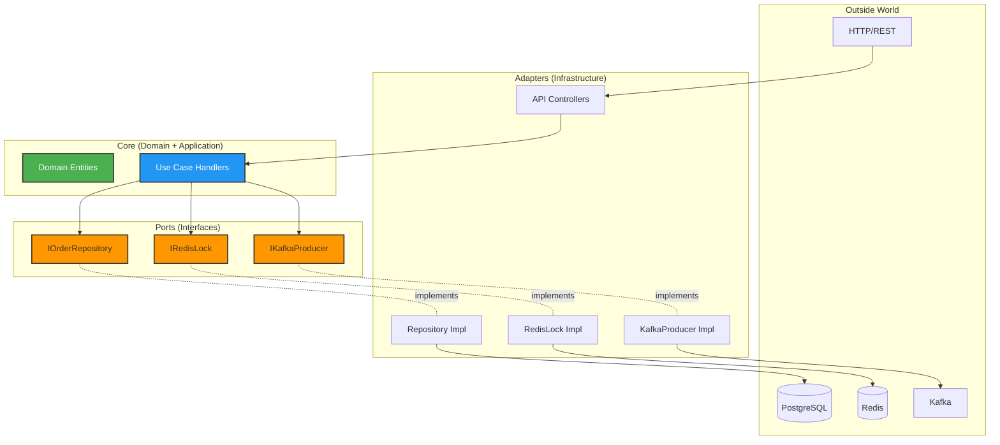
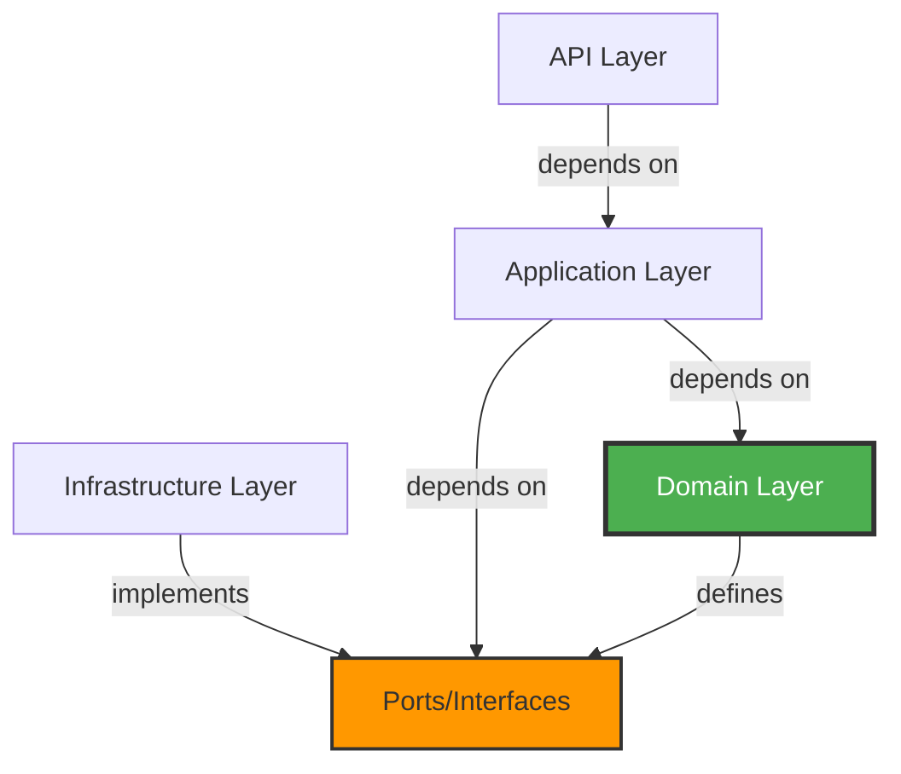

# Hexagonal Architecture

**Hexagonal Architecture** (also known as **Ports and Adapters**) is an architectural pattern that isolates the core business logic from external concerns like databases, messaging systems, and APIs. SpecKit implements this pattern across all microservices to achieve maximum testability and flexibility.

## Conceptual Overview



## Layer Structure

<Tabs>
  <Tab title="Domain Layer">
    **Location:** `services/{service}/src/{Service}.Domain/`
    
    **Contents:**
    - Domain entities (business objects)
    - Domain ports (interfaces)
    - Business rules and validations
    
    **Dependencies:** NONE (completely isolated)
    
    **Example Structure:**
    ```
    Domain/
    ├── Entities/
    │   ├── Reservation.cs
    │   └── Seat.cs
    └── Ports/
        ├── IRedisLock.cs
        ├── IKafkaProducer.cs
        └── IDbInitializer.cs
    ```
    
    **Reservation Entity:**
    ```csharp
    // services/inventory/src/Inventory.Domain/Entities/Reservation.cs
    namespace Inventory.Domain.Entities;
    
    public class Reservation
    {
        public Guid Id { get; set; }
        public Guid SeatId { get; set; }
        public string CustomerId { get; set; } = string.Empty;
        public DateTime CreatedAt { get; set; }
        public DateTime ExpiresAt { get; set; }
        public string Status { get; set; } = "active";
    
        public bool IsExpired(DateTime now)
        {
            return Status == "active" && ExpiresAt <= now;
        }
    }
    ```
    
    **IRedisLock Port:**
    ```csharp
    // services/inventory/src/Inventory.Domain/Ports/IRedisLock.cs
    namespace Inventory.Domain.Ports;
    
    public interface IRedisLock
    {
        /// <summary>
        /// Attempts to acquire a distributed lock.
        /// </summary>
        /// <returns>Lock token if successful, null otherwise</returns>
        Task<string?> AcquireLockAsync(string key, TimeSpan ttl);
    
        /// <summary>
        /// Releases a previously acquired lock.
        /// </summary>
        /// <returns>True if released, false if token mismatch</returns>
        Task<bool> ReleaseLockAsync(string key, string token);
    }
    ```
    
    **Key Principle:** Domain layer defines WHAT it needs, not HOW it's implemented.
  </Tab>
  
  <Tab title="Application Layer">
    **Location:** `services/{service}/src/{Service}.Application/`
    
    **Contents:**
    - Use case handlers (commands/queries)
    - Application ports (repository interfaces)
    - DTOs and responses
    
    **Dependencies:** Domain layer only
    
    **Example Structure:**
    ```
    Application/
    ├── UseCases/
    │   ├── CreateReservation/
    │   │   ├── CreateReservationCommand.cs
    │   │   └── CreateReservationCommandHandler.cs
    │   └── GetOrder/
    │       ├── GetOrderQuery.cs
    │       └── GetOrderHandler.cs
    ├── Ports/
    │   ├── IOrderRepository.cs
    │   └── IDbInitializer.cs
    └── DTOs/
        └── OrderDto.cs
    ```
    
    **Command Handler:**
    ```csharp
    // services/inventory/src/Application/UseCases/CreateReservation/CreateReservationCommandHandler.cs
    using MediatR;
    using Inventory.Domain.Entities;
    using Inventory.Domain.Ports;  // Uses domain ports
    using Inventory.Infrastructure.Persistence;  // DbContext only
    
    public class CreateReservationCommandHandler 
        : IRequestHandler<CreateReservationCommand, CreateReservationResponse>
    {
        // Depends on abstractions (ports), not concrete implementations
        private readonly InventoryDbContext _context;
        private readonly IRedisLock _redisLock;
        private readonly IKafkaProducer _kafkaProducer;
    
        public CreateReservationCommandHandler(
            InventoryDbContext context,
            IRedisLock redisLock,          // Port, not RedisLock class
            IKafkaProducer kafkaProducer)  // Port, not KafkaProducer class
        {
            _context = context;
            _redisLock = redisLock;
            _kafkaProducer = kafkaProducer;
        }
    
        public async Task<CreateReservationResponse> Handle(
            CreateReservationCommand request,
            CancellationToken cancellationToken)
        {
            // Business logic using ports
            var lockToken = await _redisLock.AcquireLockAsync(...);
            try
            {
                // Create reservation
                var reservation = new Reservation { ... };
                _context.Reservations.Add(reservation);
                await _context.SaveChangesAsync(cancellationToken);
                
                // Publish event
                await _kafkaProducer.ProduceAsync(...);
                
                return new CreateReservationResponse(...);
            }
            finally
            {
                await _redisLock.ReleaseLockAsync(...);
            }
        }
    }
    ```
    
    **Repository Port:**
    ```csharp
    // services/ordering/src/Application/Ports/IOrderRepository.cs
    namespace Ordering.Application.Ports;
    
    public interface IOrderRepository
    {
        Task<Order?> GetByIdAsync(Guid orderId, CancellationToken cancellationToken = default);
        Task<Order?> GetDraftOrderAsync(string? userId, string? guestToken, CancellationToken cancellationToken = default);
        Task<Order> CreateAsync(Order order, CancellationToken cancellationToken = default);
        Task<Order> UpdateAsync(Order order, CancellationToken cancellationToken = default);
    }
    ```
  </Tab>
  
  <Tab title="Infrastructure Layer">
    **Location:** `services/{service}/src/{Service}.Infrastructure/`
    
    **Contents:**
    - Adapters (implementations of ports)
    - Database context and migrations
    - External service integrations
    
    **Dependencies:** Domain, Application, external libraries
    
    **Example Structure:**
    ```
    Infrastructure/
    ├── Persistence/
    │   ├── InventoryDbContext.cs
    │   ├── OrderRepository.cs
    │   └── DbInitializer.cs
    ├── Locking/
    │   └── RedisLock.cs
    ├── Messaging/
    │   ├── KafkaProducer.cs
    │   └── ReservationEventConsumer.cs
    └── ServiceCollectionExtensions.cs
    ```
    
    **RedisLock Adapter:**
    ```csharp
    // services/inventory/src/Infrastructure/Locking/RedisLock.cs
    using Inventory.Domain.Ports;  // Implements port from domain
    using StackExchange.Redis;     // External dependency
    
    namespace Inventory.Infrastructure.Locking;
    
    public class RedisLock : IRedisLock  // Implements domain port
    {
        private readonly IConnectionMultiplexer _multiplexer;
        private readonly IDatabase _db;
    
        public RedisLock(IConnectionMultiplexer multiplexer)
        {
            _multiplexer = multiplexer;
            _db = _multiplexer.GetDatabase();
        }
    
        public async Task<string?> AcquireLockAsync(string key, TimeSpan ttl)
        {
            var token = Guid.NewGuid().ToString("N");
            
            bool acquired = await _db.StringSetAsync(
                (RedisKey)key,
                (RedisValue)token,
                ttl,
                when: When.NotExists
            );
            
            return acquired ? token : null;
        }
    
        public async Task<bool> ReleaseLockAsync(string key, string token)
        {
            var current = await _db.StringGetAsync(key);
            if (!current.HasValue) return false;
    
            if (current == token)
            {
                return await _db.KeyDeleteAsync(key);
            }
    
            return false;
        }
    }
    ```
    
    **KafkaProducer Adapter:**
    ```csharp
    // services/inventory/src/Infrastructure/Messaging/KafkaProducer.cs
    using Inventory.Domain.Ports;
    using Confluent.Kafka;
    
    namespace Inventory.Infrastructure.Messaging;
    
    public class KafkaProducer : IKafkaProducer
    {
        private readonly IProducer<string?, string> _producer;
        private readonly ILogger<KafkaProducer> _logger;
    
        public KafkaProducer(
            IProducer<string?, string> producer,
            ILogger<KafkaProducer> logger)
        {
            _producer = producer;
            _logger = logger;
        }
    
        public async Task ProduceAsync(
            string topicName,
            string message,
            string? key = null)
        {
            try
            {
                var deliveryReport = await _producer.ProduceAsync(
                    topicName,
                    new Message<string?, string>
                    {
                        Key = key,
                        Value = message
                    }
                );
    
                _logger.LogInformation(
                    "Delivered to {Topic} [{Partition}] @ {Offset}",
                    deliveryReport.Topic,
                    deliveryReport.Partition,
                    deliveryReport.Offset
                );
            }
            catch (ProduceException<string?, string> ex)
            {
                _logger.LogError(ex, "Failed to deliver to {Topic}", topicName);
                throw;
            }
        }
    }
    ```
    
    **OrderRepository Adapter:**
    ```csharp
    // services/ordering/src/Infrastructure/Persistence/OrderRepository.cs
    using Ordering.Application.Ports;  // Implements application port
    using Ordering.Domain.Entities;
    using Microsoft.EntityFrameworkCore;
    
    namespace Ordering.Infrastructure.Persistence;
    
    public class OrderRepository : IOrderRepository
    {
        private readonly OrderingDbContext _context;
    
        public OrderRepository(OrderingDbContext context)
        {
            _context = context;
        }
    
        public async Task<Order?> GetByIdAsync(
            Guid orderId,
            CancellationToken cancellationToken = default)
        {
            return await _context.Orders
                .Include(o => o.Items)
                .FirstOrDefaultAsync(o => o.Id == orderId, cancellationToken);
        }
    
        public async Task<Order> CreateAsync(
            Order order,
            CancellationToken cancellationToken = default)
        {
            _context.Orders.Add(order);
            await _context.SaveChangesAsync(cancellationToken);
            return order;
        }
    
        public async Task<Order> UpdateAsync(
            Order order,
            CancellationToken cancellationToken = default)
        {
            _context.Orders.Update(order);
            await _context.SaveChangesAsync(cancellationToken);
            return order;
        }
    }
    ```
  </Tab>
  
  <Tab title="API Layer">
    **Location:** `services/{service}/src/{Service}.Api/`
    
    **Contents:**
    - Controllers or minimal API endpoints
    - HTTP request/response handling
    - API configuration
    
    **Dependencies:** Application, Infrastructure (for DI setup)
    
    **Example Structure:**
    ```
    Api/
    ├── Controllers/
    │   ├── OrdersController.cs
    │   └── CartController.cs
    ├── Endpoints/
    │   └── ReservationEndpoints.cs
    └── Program.cs
    ```
    
    **Minimal API Endpoint:**
    ```csharp
    // services/inventory/src/Api/Endpoints/ReservationEndpoints.cs
    using MediatR;
    using Inventory.Application.UseCases.CreateReservation;
    
    public static class ReservationEndpoints
    {
        public static void MapReservationEndpoints(this IEndpointRouteBuilder app)
        {
            app.MapPost("/api/reservations", CreateReservation);
        }
    
        private static async Task<IResult> CreateReservation(
            [FromBody] CreateReservationRequest request,
            [FromServices] IMediator mediator,
            CancellationToken cancellationToken)
        {
            try
            {
                var command = new CreateReservationCommand(
                    request.SeatId,
                    request.CustomerId
                );
    
                var response = await mediator.Send(command, cancellationToken);
                return Results.Ok(response);
            }
            catch (KeyNotFoundException ex)
            {
                return Results.NotFound(new { error = ex.Message });
            }
            catch (InvalidOperationException ex)
            {
                return Results.BadRequest(new { error = ex.Message });
            }
        }
    }
    ```
    
    **Controller Example:**
    ```csharp
    // services/ordering/src/Api/Controllers/CartController.cs
    using MediatR;
    using Microsoft.AspNetCore.Mvc;
    using Ordering.Application.UseCases.AddToCart;
    
    [ApiController]
    [Route("api/[controller]")]
    public class CartController : ControllerBase
    {
        private readonly IMediator _mediator;
    
        public CartController(IMediator mediator)
        {
            _mediator = mediator;
        }
    
        [HttpPost("add")]
        public async Task<IActionResult> AddToCart(
            [FromBody] AddToCartRequest request,
            CancellationToken cancellationToken)
        {
            var command = new AddToCartCommand(
                request.SeatId,
                request.UserId,
                request.GuestToken
            );
    
            var response = await _mediator.Send(command, cancellationToken);
            return Ok(response);
        }
    }
    ```
  </Tab>
</Tabs>

## Dependency Inversion Principle

<Accordion title="The Dependency Rule">

**Core Principle:** Dependencies point INWARD toward the domain



**What This Means:**

1. **Domain layer** has ZERO dependencies
   - No references to EF Core, Redis, Kafka, etc.
   - Pure business logic

2. **Application layer** depends only on Domain
   - Uses domain entities and ports
   - No knowledge of infrastructure implementations

3. **Infrastructure layer** implements domain/application ports
   - Depends on external libraries (Confluent.Kafka, StackExchange.Redis)
   - Adapts external systems to domain interfaces

4. **API layer** orchestrates everything
   - Configures dependency injection
   - Maps HTTP to application commands/queries

</Accordion>

<Accordion title="Wiring It All Together">

**Dependency Injection Configuration:**

```csharp
// services/inventory/src/Infrastructure/ServiceCollectionExtensions.cs
using Microsoft.Extensions.DependencyInjection;
using Microsoft.Extensions.Configuration;
using Inventory.Domain.Ports;
using Inventory.Infrastructure.Locking;
using Inventory.Infrastructure.Messaging;

public static class ServiceCollectionExtensions
{
    public static IServiceCollection AddInfrastructure(
        this IServiceCollection services,
        IConfiguration configuration)
    {
        // Database
        services.AddDbContext<InventoryDbContext>(options =>
            options.UseNpgsql(
                configuration.GetConnectionString("Default"),
                npgsqlOptions => npgsqlOptions.MigrationsHistoryTable(
                    "__EFMigrationsHistory",
                    "bc_inventory"
                )
            )
        );

        services.AddScoped<IDbInitializer, DbInitializer>();

        // Redis (Singleton: one connection shared across requests)
        var redisConn = configuration.GetConnectionString("Redis") 
            ?? "localhost:6379";
        var multiplexer = ConnectionMultiplexer.Connect(redisConn);
        services.AddSingleton<IConnectionMultiplexer>(multiplexer);
        
        // Register adapter implementing IRedisLock port
        services.AddScoped<IRedisLock, RedisLock>();

        // Kafka (Singleton: one producer shared)
        var kafkaBootstrap = configuration.GetConnectionString("Kafka") 
            ?? "localhost:9092";
        var kafkaConfig = new ProducerConfig
        {
            BootstrapServers = kafkaBootstrap,
            AllowAutoCreateTopics = true,
            Acks = Acks.All
        };
        var producer = new ProducerBuilder<string?, string>(kafkaConfig).Build();
        services.AddSingleton(producer);
        
        // Register adapter implementing IKafkaProducer port
        services.AddSingleton<IKafkaProducer, KafkaProducer>();

        // Background services
        services.AddHostedService<ReservationExpiryWorker>();

        return services;
    }
}
```

**Usage in Program.cs:**

```csharp
// services/inventory/src/Api/Program.cs
var builder = WebApplication.CreateBuilder(args);

// Register application layer (MediatR handlers)
builder.Services.AddMediatR(cfg =>
    cfg.RegisterServicesFromAssembly(
        typeof(CreateReservationCommand).Assembly
    )
);

// Register infrastructure layer (adapters)
builder.Services.AddInfrastructure(builder.Configuration);

// Register API layer
builder.Services.AddControllers();

var app = builder.Build();

// Initialize database
using (var scope = app.Services.CreateScope())
{
    var dbInit = scope.ServiceProvider.GetRequiredService<IDbInitializer>();
    await dbInit.InitializeAsync();
}

app.MapControllers();
app.Run();
```

</Accordion>

## Benefits Realized in SpecKit

<CardGroup cols={2}>
  <Card title="Testability" icon="vial">
    **Domain logic tested without infrastructure:**
    
    ```csharp
    // Unit test with mocks
    [Fact]
    public async Task CreateReservation_AcquiresLock_Success()
    {
        // Arrange
        var mockRedisLock = new MockRedisLock(
            acquireResult: "token-123"
        );
        var mockKafka = new MockKafkaProducer();
        var context = CreateInMemoryContext();
        
        var handler = new CreateReservationCommandHandler(
            context,
            mockRedisLock,  // Mock, not real Redis
            mockKafka       // Mock, not real Kafka
        );
        
        // Act
        var response = await handler.Handle(
            new CreateReservationCommand(seatId, customerId),
            CancellationToken.None
        );
        
        // Assert
        Assert.NotEqual(Guid.Empty, response.ReservationId);
        mockRedisLock.Verify_AcquireLockCalled();
        mockKafka.Verify_ProduceAsyncCalled();
    }
    ```
  </Card>
  
  <Card title="Flexibility" icon="shuffle">
    **Easy to swap implementations:**
    
    ```csharp
    // Production: Real Redis
    services.AddScoped<IRedisLock, RedisLock>();
    
    // Testing: In-memory mock
    services.AddScoped<IRedisLock, MockRedisLock>();
    
    // Alternative: Distributed lock using PostgreSQL
    services.AddScoped<IRedisLock, PostgresLock>();
    ```
    
    **No changes to domain or application code required!**
  </Card>
  
  <Card title="Domain Purity" icon="gem">
    **Business logic free from technical concerns:**
    
    ```csharp
    // Domain entity - no infrastructure references
    public class Reservation
    {
        public bool IsExpired(DateTime now)
        {
            return Status == "active" && ExpiresAt <= now;
        }
    }
    ```
    
    **No:**
    - `[Table("reservations")]` attributes
    - `INotifyPropertyChanged` interfaces
    - ORM-specific code
    
    **Just pure business logic.**
  </Card>
  
  <Card title="Independent Evolution" icon="code-branch">
    **Change infrastructure without touching domain:**
    
    - Migrate from Redis to Memcached
    - Switch from Kafka to RabbitMQ
    - Replace PostgreSQL with MongoDB
    - Add caching layer
    
    **Only adapters change, core logic remains stable.**
  </Card>
</CardGroup>

## Real-World Example: Complete Flow

<Accordion title="CreateReservation End-to-End">

**1. HTTP Request arrives at API layer:**

```http
POST /api/reservations
Content-Type: application/json

{
  "seatId": "3fa85f64-5717-4562-b3fc-2c963f66afa6",
  "customerId": "customer-123"
}
```

**2. Endpoint creates command and sends to MediatR:**

```csharp
// Api/Endpoints/ReservationEndpoints.cs
var command = new CreateReservationCommand(
    request.SeatId,
    request.CustomerId
);
var response = await mediator.Send(command);
```

**3. MediatR dispatches to handler (Application layer):**

```csharp
// Application/UseCases/CreateReservation/CreateReservationCommandHandler.cs
public async Task<CreateReservationResponse> Handle(...)
{
    // Uses IRedisLock port (defined in Domain)
    var lockToken = await _redisLock.AcquireLockAsync(lockKey, ttl);
    
    try
    {
        // Business logic
        var seat = await _context.Seats.FindAsync(seatId);
        if (seat.Reserved) throw new InvalidOperationException();
        
        var reservation = new Reservation { ... };
        seat.Reserved = true;
        
        _context.Add(reservation);
        await _context.SaveChangesAsync();
        
        // Uses IKafkaProducer port (defined in Domain)
        await _kafkaProducer.ProduceAsync("reservation-created", json);
        
        return new CreateReservationResponse(...);
    }
    finally
    {
        await _redisLock.ReleaseLockAsync(lockKey, lockToken);
    }
}
```

**4. Infrastructure adapters execute:**

```csharp
// Infrastructure/Locking/RedisLock.cs (implements IRedisLock)
public async Task<string?> AcquireLockAsync(string key, TimeSpan ttl)
{
    var token = Guid.NewGuid().ToString("N");
    bool acquired = await _db.StringSetAsync(
        key, token, ttl, when: When.NotExists
    );
    return acquired ? token : null;
}
```

```csharp
// Infrastructure/Messaging/KafkaProducer.cs (implements IKafkaProducer)
public async Task ProduceAsync(string topic, string message, string? key)
{
    await _producer.ProduceAsync(topic, new Message<string?, string>
    {
        Key = key,
        Value = message
    });
}
```

**5. Response flows back to client:**

```json
{
  "reservationId": "7c9e6679-7425-40de-944b-e07fc1f90ae7",
  "seatId": "3fa85f64-5717-4562-b3fc-2c963f66afa6",
  "customerId": "customer-123",
  "expiresAt": "2026-03-04T15:45:00Z",
  "status": "active"
}
```

**Key Observation:**
- Domain defines `IRedisLock` and `IKafkaProducer` interfaces
- Application uses these interfaces without knowing implementation
- Infrastructure provides concrete implementations
- Dependency injection wires everything together at runtime

</Accordion>

## Ports vs Adapters Summary

<Tabs>
  <Tab title="Ports (Interfaces)">
    **Definition:** Interfaces defined by the core (domain/application)
    
    **SpecKit Ports:**
    
    | Port | Defined In | Purpose |
    |------|-----------|----------|
    | `IRedisLock` | Domain | Distributed locking abstraction |
    | `IKafkaProducer` | Domain | Event publishing abstraction |
    | `IDbInitializer` | Domain | Database initialization |
    | `IOrderRepository` | Application | Order persistence abstraction |
    | `IReservationValidationService` | Application | Reservation validation |
    
    **Characteristics:**
    - Defined by what the core needs
    - No implementation details
    - Stable (change infrequently)
  </Tab>
  
  <Tab title="Adapters (Implementations)">
    **Definition:** Concrete implementations in infrastructure layer
    
    **SpecKit Adapters:**
    
    | Adapter | Implements | Technology |
    |---------|-----------|------------|
    | `RedisLock` | `IRedisLock` | StackExchange.Redis |
    | `KafkaProducer` | `IKafkaProducer` | Confluent.Kafka |
    | `DbInitializer` | `IDbInitializer` | Entity Framework Core |
    | `OrderRepository` | `IOrderRepository` | EF Core + PostgreSQL |
    | `ReservationEventConsumer` | Background service | Confluent.Kafka consumer |
    
    **Characteristics:**
    - Implement port interfaces
    - Contain infrastructure-specific code
    - Can be replaced without affecting core
  </Tab>
</Tabs>

## Common Pitfalls & Solutions

<Warning>
  **Pitfall #1: Leaking Infrastructure into Domain**
  
  ```csharp
  // ❌ BAD: Domain entity with EF Core attributes
  [Table("reservations", Schema = "bc_inventory")]
  public class Reservation
  {
      [Key]
      public Guid Id { get; set; }
  }
  ```
  
  **Solution:**
  ```csharp
  // ✅ GOOD: Pure domain entity
  public class Reservation
  {
      public Guid Id { get; set; }
  }
  
  // Configure in DbContext (Infrastructure layer)
  protected override void OnModelCreating(ModelBuilder modelBuilder)
  {
      modelBuilder.Entity<Reservation>().ToTable("reservations", "bc_inventory");
      modelBuilder.Entity<Reservation>().HasKey(r => r.Id);
  }
  ```
</Warning>

<Warning>
  **Pitfall #2: Handler Depends on Concrete Implementation**
  
  ```csharp
  // ❌ BAD: Handler uses concrete RedisLock class
  public class CreateReservationCommandHandler
  {
      private readonly RedisLock _redisLock;  // Concrete class!
  }
  ```
  
  **Solution:**
  ```csharp
  // ✅ GOOD: Handler depends on interface
  public class CreateReservationCommandHandler
  {
      private readonly IRedisLock _redisLock;  // Interface
  }
  ```
</Warning>

## Related Concepts

<CardGroup cols={2}>
  <Card title="CQRS Pattern" href="/concepts/cqrs" icon="split">
    See how commands and queries fit within hexagonal architecture
  </Card>
  
  <Card title="Microservices Design" href="/concepts/microservices" icon="server">
    Learn how each service implements hexagonal architecture
  </Card>
  
  <Card title="Event-Driven Architecture" href="/concepts/event-driven" icon="bolt">
    Understand Kafka integration via ports and adapters
  </Card>
  
  <Card title="System Architecture" href="/concepts/architecture" icon="sitemap">
    View complete architecture overview
  </Card>
</CardGroup>