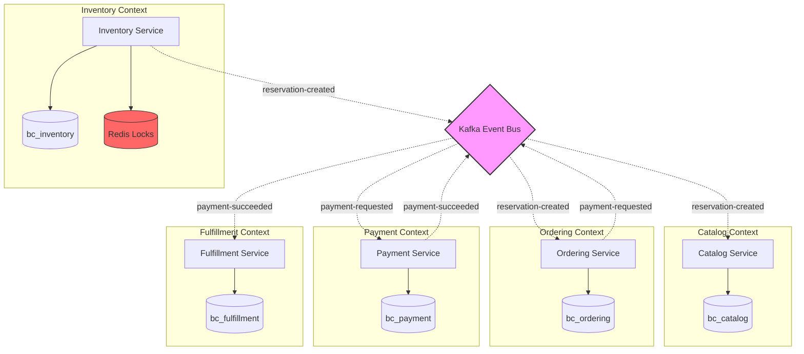

# Microservices Design

SpecKit's microservices architecture divides the ticketing platform into **seven independent services**, each responsible for a specific business capability. This design enables independent deployment, scaling, and development.

## Service Catalog

<CardGroup cols={2}>
  <Card title="Catalog Service" icon="book-open">
    **Port:** 5001  
    **Responsibility:** Event browsing and seat information
    
    **Capabilities:**
    - List all events
    - Get event details
    - Retrieve seat maps with real-time availability
    
    **Technology:**
    - PostgreSQL (schema: `bc_catalog`)
    - Kafka consumer (updates seat status from inventory)
  </Card>
  
  <Card title="Inventory Service" icon="warehouse">
    **Port:** 5002  
    **Responsibility:** Seat reservations and availability management
    
    **Capabilities:**
    - Create seat reservations with distributed locking
    - Manage reservation expiry (15-minute TTL)
    - Publish reservation lifecycle events
    
    **Technology:**
    - PostgreSQL (schema: `bc_inventory`)
    - Redis (distributed locks)
    - Kafka producer/consumer
  </Card>
  
  <Card title="Ordering Service" icon="shopping-cart">
    **Port:** 5003  
    **Responsibility:** Shopping cart and order management
    
    **Capabilities:**
    - Maintain draft orders (cart)
    - Checkout and order finalization
    - Validate reservations before purchase
    
    **Technology:**
    - PostgreSQL (schema: `bc_ordering`)
    - Kafka consumer (reservation events)
    - In-memory `ReservationStore`
  </Card>
  
  <Card title="Payment Service" icon="credit-card">
    **Port:** 5004  
    **Responsibility:** Payment processing and validation
    
    **Capabilities:**
    - Process payments (simulated gateway)
    - Validate order and reservation states
    - Publish payment success/failure events
    
    **Technology:**
    - PostgreSQL (schema: `bc_payment`)
    - Kafka producer/consumer
    - Event-based validation
  </Card>
  
  <Card title="Fulfillment Service" icon="ticket">
    **Port:** 5005  
    **Responsibility:** Ticket generation and delivery
    
    **Capabilities:**
    - Generate digital tickets
    - Link tickets to completed payments
    - Publish ticket-issued events
    
    **Technology:**
    - PostgreSQL (schema: `bc_fulfillment`)
    - Kafka consumer
  </Card>
  
  <Card title="Identity Service" icon="user">
    **Port:** 5000  
    **Responsibility:** User authentication and authorization
    
    **Capabilities:**
    - User registration and login
    - JWT token generation
    - Guest token management
    
    **Technology:**
    - PostgreSQL (schema: `bc_identity`)
    - BCrypt password hashing
  </Card>
  
  <Card title="Notification Service" icon="envelope">
    **Port:** 5006  
    **Responsibility:** Customer notifications
    
    **Capabilities:**
    - Send ticket delivery emails
    - Track notification history
    - SMTP integration
    
    **Technology:**
    - PostgreSQL (schema: `bc_notification`)
    - Kafka consumer
    - SMTP client
  </Card>
</CardGroup>

## Service Boundaries



### Boundary Principles

<Tabs>
  <Tab title="Data Ownership">
    **Rule:** Each service exclusively owns its data schema
    
    ```csharp
    // services/inventory/src/Infrastructure/Persistence/DbInitializer.cs
    public async Task InitializeAsync()
    {
        var connection = _db.Database.GetDbConnection();
        await connection.OpenAsync();
        
        // Create dedicated schema
        using var createCommand = connection.CreateCommand();
        createCommand.CommandText = @"
            CREATE SCHEMA IF NOT EXISTS bc_inventory;
            ALTER SCHEMA bc_inventory OWNER TO postgres;
        ";
        await createCommand.ExecuteNonQueryAsync();
        
        // Apply migrations only for this service
        await _db.Database.MigrateAsync();
    }
    ```
    
    **Benefits:**
    - No cross-schema foreign keys
    - Independent schema evolution
    - Clear data boundaries
  </Tab>
  
  <Tab title="Communication Contracts">
    **Rule:** Services communicate via versioned contracts
    
    ```csharp
    // Kafka event contract
    public record ReservationCreatedEvent
    {
        [JsonPropertyName("eventId")]
        public string EventId { get; init; } = string.Empty;
        
        [JsonPropertyName("reservationId")]
        public string ReservationId { get; init; } = string.Empty;
        
        [JsonPropertyName("customerId")]
        public string? CustomerId { get; init; }
        
        [JsonPropertyName("seatId")]
        public string SeatId { get; init; } = string.Empty;
        
        [JsonPropertyName("expiresAt")]
        public DateTime ExpiresAt { get; init; }
        
        [JsonPropertyName("status")]
        public string Status { get; init; } = "active";
    }
    ```
    
    **Key Properties:**
    - JSON serialization with explicit property names
    - Backward-compatible field additions
    - No shared domain models between services
  </Tab>
  
  <Tab title="Autonomy">
    **Rule:** Services can be deployed and scaled independently
    
    ```yaml
    # docker-compose.yml
    inventory-service:
      build: ./services/inventory
      ports:
        - "5002:5002"
      environment:
        - ConnectionStrings__Default=Host=postgres;...
        - ConnectionStrings__Redis=redis:6379
        - ConnectionStrings__Kafka=kafka:9092
      depends_on:
        - postgres
        - redis
        - kafka
    
    ordering-service:
      build: ./services/ordering
      ports:
        - "5003:5003"
      # Independent configuration
    ```
    
    **Independence Characteristics:**
    - Separate Docker containers
    - Own configuration and secrets
    - Can use different tech stacks if needed
  </Tab>
</Tabs>

## Communication Patterns

### 1. Synchronous REST Communication

<Accordion title="Request-Response Pattern">

**Use Case:** Frontend queries Catalog Service for events

```csharp
// services/catalog/src/Api/Controllers/EventsController.cs
[ApiController]
[Route("api/[controller]")]
public class EventsController : ControllerBase
{
    private readonly IMediator _mediator;

    [HttpGet]
    public async Task<IActionResult> GetAllEvents(
        CancellationToken cancellationToken)
    {
        var query = new GetAllEventsQuery();
        var response = await _mediator.Send(query, cancellationToken);
        return Ok(response);
    }

    [HttpGet("{eventId}/seatmap")]
    public async Task<IActionResult> GetEventSeatmap(
        Guid eventId,
        CancellationToken cancellationToken)
    {
        var query = new GetEventSeatmapQuery(eventId);
        var response = await _mediator.Send(query, cancellationToken);
        return Ok(response);
    }
}
```

**Handler Implementation:**

```csharp
// services/catalog/src/Application/UseCases/GetAllEvents/GetAllEventsHandler.cs
public class GetAllEventsHandler 
    : IRequestHandler<GetAllEventsQuery, GetAllEventsResponse>
{
    private readonly ICatalogRepository _repository;

    public async Task<GetAllEventsResponse> Handle(
        GetAllEventsQuery request,
        CancellationToken cancellationToken)
    {
        var events = await _repository.GetAllEventsAsync(cancellationToken);
        
        return new GetAllEventsResponse(
            events.Select(e => new EventDto
            {
                Id = e.Id,
                Name = e.Name,
                Date = e.Date,
                Location = e.Location
            })
        );
    }
}
```

**When to Use:**
- User-initiated queries requiring immediate response
- Operations within a single bounded context
- Simple CRUD operations

</Accordion>

### 2. Asynchronous Event-Driven Communication

<Accordion title="Event Choreography Pattern">

**Use Case:** Reservation lifecycle across multiple services

**Step 1: Inventory publishes reservation-created event**

```csharp
// services/inventory/src/Application/UseCases/CreateReservation/CreateReservationCommandHandler.cs
private async Task PublishReservationCreatedEvent(
    Reservation reservation, 
    Seat seat, 
    CancellationToken cancellationToken)
{
    var @event = new ReservationCreatedEvent(
        EventId: Guid.NewGuid().ToString("D"),
        ReservationId: reservation.Id.ToString("D"),
        CustomerId: reservation.CustomerId,
        SeatId: reservation.SeatId.ToString("D"),
        SeatNumber: $"{seat.Section}-{seat.Row}-{seat.Number}",
        Section: seat.Section,
        BasePrice: 0m,
        CreatedAt: reservation.CreatedAt,
        ExpiresAt: reservation.ExpiresAt,
        Status: reservation.Status
    );

    var json = JsonSerializer.Serialize(@event, _jsonOptions);
    await _kafkaProducer.ProduceAsync(
        "reservation-created", 
        json, 
        reservation.SeatId.ToString("N")
    );
}
```

**Step 2: Ordering consumes event and updates local state**

```csharp
// services/ordering/src/Infrastructure/Events/ReservationEventConsumer.cs
public class ReservationEventConsumer : BackgroundService
{
    protected override async Task ExecuteAsync(
        CancellationToken stoppingToken)
    {
        var config = new ConsumerConfig
        {
            BootstrapServers = _kafkaOptions.BootstrapServers,
            GroupId = _kafkaOptions.ConsumerGroupId,
            AutoOffsetReset = AutoOffsetReset.Earliest,
            EnableAutoCommit = true
        };

        using var consumer = new ConsumerBuilder<string, string>(config)
            .Build();

        consumer.Subscribe(new[] { 
            "reservation-created", 
            "reservation-expired",
            "payment-succeeded" 
        });

        while (!stoppingToken.IsCancellationRequested)
        {
            var consumeResult = consumer.Consume(stoppingToken);
            await ProcessMessage(
                consumeResult.Topic, 
                consumeResult.Message.Value, 
                stoppingToken
            );
        }
    }

    private async Task ProcessMessage(
        string topic, 
        string messageValue, 
        CancellationToken cancellationToken)
    {
        using var scope = _serviceProvider.CreateScope();
        var reservationStore = scope.ServiceProvider
            .GetRequiredService<ReservationStore>();

        switch (topic)
        {
            case "reservation-created":
                var createdEvent = JsonSerializer
                    .Deserialize<ReservationCreatedEvent>(messageValue);
                reservationStore.AddReservation(createdEvent);
                break;

            case "reservation-expired":
                var expiredEvent = JsonSerializer
                    .Deserialize<ReservationExpiredEvent>(messageValue);
                reservationStore.RemoveReservation(expiredEvent);
                break;
        }
    }
}
```

**When to Use:**
- Cross-service workflows (checkout → payment → fulfillment)
- Long-running processes
- Services should remain decoupled

</Accordion>

## Service Independence Strategies

<Tabs>
  <Tab title="Data Isolation">
    **Strategy:** Each service maintains its own projection of shared data
    
    **Example:** Ordering service needs reservation data
    
    ```csharp
    // services/ordering/src/Infrastructure/Events/ReservationStore.cs
    public class ReservationStore
    {
        // In-memory cache of active reservations
        private readonly ConcurrentDictionary<string, ReservationCreatedEvent> 
            _activeReservations = new();

        public void AddReservation(ReservationCreatedEvent @event)
        {
            _activeReservations[@event.ReservationId] = @event;
        }

        public void RemoveReservation(ReservationExpiredEvent @event)
        {
            _activeReservations.TryRemove(@event.ReservationId, out _);
        }

        public ReservationCreatedEvent? GetReservation(string seatId)
        {
            return _activeReservations.Values
                .FirstOrDefault(r => r.SeatId == seatId 
                    && r.Status == "active");
        }
    }
    ```
    
    **Benefits:**
    - No direct database queries to Inventory service
    - Eventually consistent read model
    - Ordering service remains operational even if Inventory is down
  </Tab>
  
  <Tab title="Circuit Breaker (Future)">
    **Strategy:** Graceful degradation when downstream services fail
    
    **Pattern (Recommended for Production):**
    
    ```csharp
    // Future implementation with Polly
    var circuitBreakerPolicy = Policy
        .Handle<HttpRequestException>()
        .CircuitBreakerAsync(
            handledEventsAllowedBeforeBreaking: 3,
            durationOfBreak: TimeSpan.FromSeconds(30)
        );

    // Wrap HTTP calls to other services
    await circuitBreakerPolicy.ExecuteAsync(async () =>
    {
        var response = await httpClient.GetAsync(
            "http://catalog-service/api/events"
        );
        return response;
    });
    ```
    
    **Note:** Currently marked as technical debt. See `deptReport.md` for migration plan.
  </Tab>
  
  <Tab title="Distributed Transactions">
    **Strategy:** Avoid distributed transactions; use event choreography instead
    
    **Anti-Pattern (Not Used):**
    ```
    BEGIN DISTRIBUTED TRANSACTION
      - Update Inventory database
      - Update Ordering database
      - Update Payment database
    COMMIT
    ```
    
    **SpecKit Approach:**
    ```
    1. Inventory creates reservation (local transaction)
    2. Publish reservation-created event
    3. Ordering reacts to event (local transaction)
    4. User checks out (local transaction)
    5. Payment processes (local transaction)
    6. Publish payment-succeeded event
    7. Fulfillment reacts (local transaction)
    ```
    
    **Compensation for Failures:**
    - Reservation expiry worker automatically releases expired reservations
    - Payment failures trigger `payment-failed` event
    - Services can implement compensating transactions
  </Tab>
</Tabs>

## Service Discovery & Configuration

<Accordion title="Docker Compose Setup">

```yaml
# infra/docker-compose.yml (simplified)
version: '3.8'

services:
  # Infrastructure
  postgres:
    image: postgres:16
    environment:
      POSTGRES_DB: ticketing
      POSTGRES_USER: postgres
      POSTGRES_PASSWORD: postgres
    ports:
      - "5432:5432"

  redis:
    image: redis:7-alpine
    ports:
      - "6379:6379"

  kafka:
    image: confluentinc/cp-kafka:7.5.0
    environment:
      KAFKA_BROKER_ID: 1
      KAFKA_ZOOKEEPER_CONNECT: zookeeper:2181
      KAFKA_ADVERTISED_LISTENERS: PLAINTEXT://kafka:9092
    ports:
      - "9092:9092"

  # Microservices
  inventory-service:
    build: ../services/inventory
    environment:
      - ASPNETCORE_URLS=http://+:5002
      - ConnectionStrings__Default=Host=postgres;Database=ticketing;...
      - ConnectionStrings__Redis=redis:6379
      - ConnectionStrings__Kafka=kafka:9092
    ports:
      - "5002:5002"
    depends_on:
      - postgres
      - redis
      - kafka

  ordering-service:
    build: ../services/ordering
    environment:
      - ASPNETCORE_URLS=http://+:5003
      - ConnectionStrings__Default=Host=postgres;Database=ticketing;...
      - Kafka__BootstrapServers=kafka:9092
    ports:
      - "5003:5003"
```

**Service Discovery:**
- Docker Compose provides internal DNS (e.g., `kafka`, `postgres`, `redis`)
- Services reference each other by container name
- For Kubernetes deployment, consider using service mesh (Istio, Linkerd)

</Accordion>

## Deployment Strategies

<CardGroup cols={2}>
  <Card title="Independent Deployment" icon="rocket">
    Each service has its own:
    - Dockerfile
    - Build pipeline
    - Versioning
    - Rollback capability
    
    Services can be deployed without coordinating releases.
  </Card>
  
  <Card title="Database Migrations" icon="database">
    Each service manages its own migrations:
    
    ```csharp
    // Auto-apply migrations on startup
    using (var scope = app.Services.CreateScope())
    {
        var dbInit = scope.ServiceProvider
            .GetRequiredService<IDbInitializer>();
        await dbInit.InitializeAsync();
    }
    ```
    
    Uses EF Core schema-specific migrations:
    ```bash
    __EFMigrationsHistory in bc_inventory
    __EFMigrationsHistory in bc_ordering
    ```
  </Card>
</CardGroup>

## Anti-Patterns to Avoid

<Warning>
  **Direct Database Access:**
  
  Never query another service's database directly. Use events or APIs.
  
  ```csharp
  // ❌ BAD: Ordering service queries Inventory database
  var seat = await inventoryDbContext.Seats.FindAsync(seatId);
  
  // ✅ GOOD: Ordering service uses event-sourced data
  var reservation = _reservationStore.GetReservation(seatId);
  ```
</Warning>

<Warning>
  **Shared Domain Models:**
  
  Don't share domain entities between services. Use DTOs/events.
  
  ```csharp
  // ❌ BAD: Shared.dll with common entities
  public class Reservation { ... } // Used by both Inventory and Ordering
  
  // ✅ GOOD: Each service has its own model
  // Inventory service
  public class Reservation { ... }
  
  // Ordering service
  public class ReservationCreatedEvent { ... } // Event contract only
  ```
</Warning>

## Related Concepts

<CardGroup cols={2}>
  <Card title="Event-Driven Architecture" href="/concepts/event-driven" icon="bolt">
    Learn how Kafka enables service choreography
  </Card>
  
  <Card title="Hexagonal Architecture" href="/concepts/hexagonal-architecture" icon="hexagon">
    Understand the internal structure of each service
  </Card>
  
  <Card title="CQRS Pattern" href="/concepts/cqrs" icon="split">
    See how commands and queries are separated
  </Card>
  
  <Card title="System Architecture" href="/concepts/architecture" icon="sitemap">
    View the complete architecture overview
  </Card>
</CardGroup>