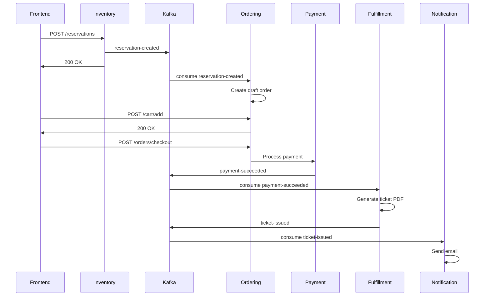

## Overview

The SpecKit Ticketing Platform uses **Apache Kafka** for event-driven communication between microservices. This guide covers all Kafka topics, event schemas, producer/consumer patterns, and best practices.

## Kafka Topics

The platform uses 5 core topics for event choreography:

| Topic | Producer | Consumer | Purpose |
|-------|----------|----------|---------|
| `reservation-created` | Inventory | Ordering | Notify when a seat is reserved |
| `reservation-expired` | Inventory | Ordering | Notify when a reservation TTL expires |
| `payment-succeeded` | Payment | Fulfillment, Inventory | Trigger ticket generation and seat confirmation |
| `payment-failed` | Payment | Ordering, Inventory | Release reservation on payment failure |
| `ticket-issued` | Fulfillment | Notification | Send ticket to customer |

## Event Schemas

### reservation-created

Published by **Inventory Service** when a seat is successfully reserved:

```json
{
  "eventId": "550e8400-e29b-41d4-a716-446655440000",
  "reservationId": "8bf7fffc-9ff5-401c-9d2d-86f525f42e40",
  "customerId": "customer-123",
  "seatId": "550e8400-e29b-41d4-a716-446655440002",
  "seatNumber": "A-1-2",
  "section": "VIP",
  "basePrice": 50.00,
  "createdAt": "2026-03-04T20:30:00Z",
  "expiresAt": "2026-03-04T20:45:00Z",
  "status": "active"
}
```

**Consumer Actions**:
- **Ordering Service**: Creates draft order and associates reservation with cart

### payment-succeeded

Published by **Payment Service** after successful payment processing:

```json
{
  "paymentId": "payment-uuid-001",
  "orderId": "order-uuid-001",
  "customerId": "customer-123",
  "reservationId": "8bf7fffc-9ff5-401c-9d2d-86f525f42e40",
  "amount": 50.00,
  "currency": "USD",
  "paymentMethod": "credit_card",
  "transactionId": "txn-abc123",
  "processedAt": "2026-03-04T20:35:00Z",
  "status": "succeeded"
}
```

**Consumer Actions**:
- **Fulfillment Service**: Generates ticket PDF with QR code
- **Inventory Service**: Marks seat as sold and releases Redis lock

### payment-failed

Published by **Payment Service** when payment is declined or fails:

```json
{
  "paymentId": "payment-uuid-002",
  "orderId": "order-uuid-002",
  "customerId": "customer-456",
  "reservationId": "reservation-uuid-002",
  "amount": 75.00,
  "currency": "USD",
  "paymentMethod": "credit_card",
  "errorCode": "card_declined",
  "errorMessage": "Insufficient funds",
  "failureReason": "insufficient_funds",
  "attemptedAt": "2026-03-04T20:40:00Z",
  "status": "failed"
}
```

**Consumer Actions**:
- **Ordering Service**: Marks order as cancelled
- **Inventory Service**: Releases seat and removes Redis lock

### ticket-issued

Published by **Fulfillment Service** after ticket PDF generation:

```json
{
  "ticketId": "ticket-uuid-001",
  "ticketNumber": "TKT-2026-001234",
  "orderId": "order-uuid-001",
  "paymentId": "payment-uuid-001",
  "customerId": "customer-123",
  "eventId": "event-uuid-001",
  "seatId": "seat-uuid-001",
  "seatNumber": "A-1-2",
  "section": "VIP",
  "pdfPath": "/app/data/tickets/ticket-uuid-001.pdf",
  "qrCode": "TKT-2026-001234-ABC123",
  "issuedAt": "2026-03-04T20:36:00Z",
  "status": "generated"
}
```

**Consumer Actions**:
- **Notification Service**: Sends email with ticket PDF attachment

### reservation-expired

Published by **Inventory Service** when a reservation TTL expires:

```json
{
  "reservationId": "reservation-uuid-003",
  "seatId": "seat-uuid-003",
  "customerId": "customer-789",
  "createdAt": "2026-03-04T20:00:00Z",
  "expiresAt": "2026-03-04T20:15:00Z",
  "expiredAt": "2026-03-04T20:15:01Z",
  "status": "expired"
}
```

**Consumer Actions**:
- **Ordering Service**: Removes items from draft orders

## Producer Implementation

### Publishing Events with KafkaProducer

```csharp
public class KafkaProducer : IKafkaProducer
{
    private readonly IProducer<string, string> _producer;

    public KafkaProducer(IConfiguration configuration)
    {
        var config = new ProducerConfig
        {
            BootstrapServers = configuration["Kafka:BootstrapServers"],
            Acks = Acks.All,
            EnableIdempotence = true
        };

        _producer = new ProducerBuilder<string, string>(config).Build();
    }

    public async Task PublishAsync<T>(string topic, T eventData) where T : class
    {
        var json = JsonSerializer.Serialize(eventData);
        var message = new Message<string, string>
        {
            Key = Guid.NewGuid().ToString(),
            Value = json
        };

        await _producer.ProduceAsync(topic, message);
    }
}
```

**Usage in Inventory Service**:

```csharp
public class CreateReservationHandler
{
    private readonly IKafkaProducer _kafkaProducer;

    public async Task<ReservationDto> Handle(CreateReservationCommand request)
    {
        // Create reservation in database
        var reservation = await _repository.AddAsync(newReservation);

        // Publish event
        await _kafkaProducer.PublishAsync("reservation-created", new
        {
            EventId = reservation.EventId,
            ReservationId = reservation.Id,
            CustomerId = reservation.CustomerId,
            SeatId = reservation.SeatId,
            SeatNumber = seat.SeatNumber,
            Section = seat.SectionCode,
            BasePrice = seat.Price,
            CreatedAt = reservation.CreatedAt,
            ExpiresAt = reservation.ExpiresAt,
            Status = "active"
        });

        return MapToDto(reservation);
    }
}
```

## Consumer Implementation

### Background Service Consumer

```csharp
public class ReservationEventConsumer : BackgroundService
{
    private readonly IConsumer<string, string> _consumer;
    private readonly IServiceProvider _serviceProvider;

    public ReservationEventConsumer(
        IConfiguration configuration,
        IServiceProvider serviceProvider)
    {
        var config = new ConsumerConfig
        {
            BootstrapServers = configuration["Kafka:BootstrapServers"],
            GroupId = "ordering-service-group",
            AutoOffsetReset = AutoOffsetReset.Earliest,
            EnableAutoCommit = false
        };

        _consumer = new ConsumerBuilder<string, string>(config).Build();
        _serviceProvider = serviceProvider;
    }

    protected override async Task ExecuteAsync(CancellationToken stoppingToken)
    {
        _consumer.Subscribe("reservation-created");

        while (!stoppingToken.IsCancellationRequested)
        {
            var consumeResult = _consumer.Consume(stoppingToken);

            using var scope = _serviceProvider.CreateScope();
            var mediator = scope.ServiceProvider.GetRequiredService<IMediator>();

            var eventData = JsonSerializer.Deserialize<ReservationCreatedEvent>(
                consumeResult.Message.Value
            );

            await mediator.Send(new ProcessReservationCommand(eventData));

            _consumer.Commit(consumeResult);
        }
    }
}
```

**Register in Program.cs**:

```csharp
builder.Services.AddHostedService<ReservationEventConsumer>();
```

## Event Flow Diagram



## Best Practices

### Idempotency

Always check if an event has already been processed:

```csharp
public async Task Handle(ReservationCreatedEvent @event)
{
    // Check if already processed
    var existing = await _repository.GetByReservationIdAsync(@event.ReservationId);
    if (existing != null)
    {
        _logger.LogInformation("Event already processed: {ReservationId}", @event.ReservationId);
        return;
    }

    // Process event
    await _repository.AddAsync(newOrder);
}
```

### Error Handling

Use retry policies for transient failures:

```csharp
try
{
    await ProcessEventAsync(@event);
}
catch (Exception ex)
{
    _logger.LogError(ex, "Failed to process event: {EventId}", @event.EventId);

    // Send to dead-letter queue for manual review
    await _deadLetterQueue.SendAsync(@event);
}
```

### Event Versioning

Include schema version in events:

```json
{
  "schemaVersion": "1.0",
  "reservationId": "...",
  "..."
}
```

### Message Ordering

For events that must be processed in order, use the same partition key:

```csharp
var message = new Message<string, string>
{
    Key = reservation.SeatId.ToString(),  // Same seat = same partition
    Value = json
};
```

## Monitoring Kafka

### List Topics

```bash
docker exec speckit-kafka kafka-topics --list --bootstrap-server localhost:9092
```

### View Messages

```bash
docker exec speckit-kafka kafka-console-consumer \
  --bootstrap-server localhost:9092 \
  --topic reservation-created \
  --from-beginning
```

### Check Consumer Groups

```bash
docker exec speckit-kafka kafka-consumer-groups \
  --bootstrap-server localhost:9092 \
  --describe \
  --group ordering-service-group
```

### Monitor Lag

```bash
docker exec speckit-kafka kafka-consumer-groups \
  --bootstrap-server localhost:9092 \
  --describe \
  --group ordering-service-group \
  --offsets
```

## Troubleshooting

<Accordion title="Consumer not receiving messages">
  **Check consumer group status**:
  ```bash
  docker exec speckit-kafka kafka-consumer-groups --list --bootstrap-server localhost:9092
  ```

  **Verify topic exists**:
  ```bash
  docker exec speckit-kafka kafka-topics --list --bootstrap-server localhost:9092
  ```

  **Check service logs**:
  ```bash
  docker logs speckit-ordering -f
  ```
</Accordion>

<Accordion title="Messages stuck in topic">
  **Check consumer lag**:
  ```bash
  docker exec speckit-kafka kafka-consumer-groups \
    --bootstrap-server localhost:9092 \
    --describe \
    --group ordering-service-group
  ```

  If lag is increasing, the consumer may be throwing exceptions. Check service logs for errors.
</Accordion>

<Accordion title="Duplicate message processing">
  Ensure your consumers are **idempotent**. Check if the event has already been processed before taking action.

  Use database constraints or unique indexes to prevent duplicate records.
</Accordion>

## Next Steps

<CardGroup cols={2}>
  <Card title="Services" icon="cubes" href="/services/catalog">
    Learn about each microservice and its role in the platform
  </Card>
  <Card title="Testing Strategy" icon="vial" href="/guides/testing-strategy">
    Test event-driven workflows with Testcontainers and smoke tests
  </Card>
</CardGroup>
