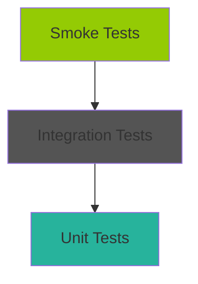

## Overview

The SpecKit Ticketing Platform follows an **ATDD (Acceptance Test Driven Development)** approach with a comprehensive testing pyramid: unit tests, integration tests, and smoke tests. This guide explains the testing strategy, tools, and best practices.

## Testing Pyramid



- **Unit Tests** (70%): Fast, isolated tests for domain logic and application layer
- **Integration Tests** (20%): Test infrastructure adapters with real dependencies (Testcontainers)
- **Smoke Tests** (10%): End-to-end tests with Docker Compose

## ATDD Workflow

The platform follows a **Red-Green-Refactor** cycle starting from Gherkin acceptance criteria:

<Steps>
  <Step title="Write Acceptance Criteria (Gherkin)">
    Define features in Gherkin format:

    ```gherkin
    Feature: Seat Reservation
      As a Customer
      I want to reserve a seat for 15 minutes
      So that I can complete my purchase without losing my seat

      Scenario: Successful seat reservation
        Given a seat is available
        When I request to reserve the seat
        Then the reservation should be created
        And the seat should be locked in Redis for 15 minutes
        And a reservation-created event should be published to Kafka
    ```
  </Step>

  <Step title="RED Phase - Write Failing Tests">
    Write tests that fail because the implementation doesn't exist yet:

    ```csharp
    [Fact]
    public async Task Handle_ValidRequest_ShouldCreateReservation()
    {
        // ARRANGE: Setup test data
        var seatId = Guid.NewGuid();
        var customerId = Guid.NewGuid();
        var command = new CreateReservationCommand(seatId, customerId);

        // ACT: Execute the command (will fail - handler doesn't exist)
        var result = await _handler.Handle(command, CancellationToken.None);

        // ASSERT: Verify reservation created
        result.Should().NotBeNull();
        result.ReservationId.Should().NotBeEmpty();
    }
    ```

    **Run test**: ❌ Test fails (CreateReservationHandler doesn't exist)
  </Step>

  <Step title="GREEN Phase - Implement Minimal Code">
    Implement just enough code to make the test pass:

    ```csharp
    public class CreateReservationHandler : IRequestHandler<CreateReservationCommand, ReservationDto>
    {
        public async Task<ReservationDto> Handle(CreateReservationCommand request, CancellationToken ct)
        {
            var reservation = new Reservation
            {
                Id = Guid.NewGuid(),
                SeatId = request.SeatId,
                CustomerId = request.CustomerId,
                ExpiresAt = DateTime.UtcNow.AddMinutes(15),
                Status = ReservationStatus.Active
            };

            await _repository.AddAsync(reservation);
            return MapToDto(reservation);
        }
    }
    ```

    **Run test**: ✅ Test passes
  </Step>

  <Step title="REFACTOR Phase - Improve Code Quality">
    Refactor the implementation while keeping tests green:

    - Extract Redis locking logic to a separate service
    - Add Kafka event publishing
    - Improve error handling
    - Add validation

    **Run tests again**: ✅ All tests still pass
  </Step>
</Steps>

## Unit Testing

### Domain Layer Tests

Test domain entities and value objects in isolation:

```csharp
public class ReservationTests
{
    [Fact]
    public void Create_WithValidData_ShouldSucceed()
    {
        // Arrange
        var seatId = Guid.NewGuid();
        var customerId = Guid.NewGuid();

        // Act
        var reservation = new Reservation
        {
            Id = Guid.NewGuid(),
            SeatId = seatId,
            CustomerId = customerId,
            CreatedAt = DateTime.UtcNow,
            ExpiresAt = DateTime.UtcNow.AddMinutes(15),
            Status = ReservationStatus.Active
        };

        // Assert
        reservation.Id.Should().NotBeEmpty();
        reservation.SeatId.Should().Be(seatId);
        reservation.CustomerId.Should().Be(customerId);
        reservation.Status.Should().Be(ReservationStatus.Active);
        reservation.IsActive().Should().BeTrue();
    }

    [Fact]
    public void IsExpired_WhenExpirationPassed_ShouldReturnTrue()
    {
        // Arrange
        var reservation = new Reservation
        {
            ExpiresAt = DateTime.UtcNow.AddMinutes(-1)
        };

        // Act & Assert
        reservation.IsExpired().Should().BeTrue();
    }
}
```

**Location**: `services/inventory/tests/Inventory.UnitTests/Domain/ReservationTests.cs`

### Application Layer Tests

Test use cases with mocked dependencies:

```csharp
public class CreateReservationHandlerTests
{
    private readonly Mock<IReservationRepository> _repositoryMock;
    private readonly Mock<IRedisLockService> _lockServiceMock;
    private readonly Mock<IKafkaProducer> _kafkaProducerMock;
    private readonly CreateReservationHandler _handler;

    public CreateReservationHandlerTests()
    {
        _repositoryMock = new Mock<IReservationRepository>();
        _lockServiceMock = new Mock<IRedisLockService>();
        _kafkaProducerMock = new Mock<IKafkaProducer>();

        _handler = new CreateReservationHandler(
            _repositoryMock.Object,
            _lockServiceMock.Object,
            _kafkaProducerMock.Object
        );
    }

    [Fact]
    public async Task Handle_WhenSeatAvailable_ShouldCreateReservation()
    {
        // Arrange
        var seatId = Guid.NewGuid();
        var command = new CreateReservationCommand(seatId, Guid.NewGuid());

        _lockServiceMock
            .Setup(x => x.AcquireLockAsync(It.IsAny<string>(), It.IsAny<TimeSpan>()))
            .ReturnsAsync(true);

        // Act
        var result = await _handler.Handle(command, CancellationToken.None);

        // Assert
        result.Should().NotBeNull();
        _repositoryMock.Verify(x => x.AddAsync(It.IsAny<Reservation>()), Times.Once);
        _kafkaProducerMock.Verify(x => x.PublishAsync("reservation-created", It.IsAny<object>()), Times.Once);
    }

    [Fact]
    public async Task Handle_WhenSeatAlreadyReserved_ShouldThrowException()
    {
        // Arrange
        var command = new CreateReservationCommand(Guid.NewGuid(), Guid.NewGuid());

        _lockServiceMock
            .Setup(x => x.AcquireLockAsync(It.IsAny<string>(), It.IsAny<TimeSpan>()))
            .ReturnsAsync(false);

        // Act & Assert
        await Assert.ThrowsAsync<SeatAlreadyReservedException>(
            () => _handler.Handle(command, CancellationToken.None)
        );
    }
}
```

**Location**: `services/inventory/tests/Inventory.Application.UnitTests/UseCases/CreateReservationHandlerTests.cs`

### Running Unit Tests

```bash
# Run all unit tests
dotnet test

# Run tests for specific service
dotnet test services/inventory/tests/Inventory.UnitTests

# Run with code coverage
dotnet test /p:CollectCoverage=true /p:CoverletOutputFormat=lcov

# Watch mode (re-run on file changes)
dotnet watch test
```

## Integration Testing

### Testcontainers Setup

Integration tests use **Testcontainers** to spin up real PostgreSQL, Redis, and Kafka instances:

```csharp
public class IntegrationTestFixture : IAsyncLifetime
{
    private readonly PostgreSqlContainer _postgresContainer;
    private readonly RedisContainer _redisContainer;
    private readonly KafkaContainer _kafkaContainer;

    public IntegrationTestFixture()
    {
        _postgresContainer = new PostgreSqlBuilder()
            .WithImage("postgres:17")
            .WithDatabase("ticketing_test")
            .WithUsername("postgres")
            .WithPassword("postgres")
            .Build();

        _redisContainer = new RedisBuilder()
            .WithImage("redis:7")
            .Build();

        _kafkaContainer = new KafkaBuilder()
            .WithImage("confluentinc/cp-kafka:7.5.0")
            .Build();
    }

    public async Task InitializeAsync()
    {
        await _postgresContainer.StartAsync();
        await _redisContainer.StartAsync();
        await _kafkaContainer.StartAsync();
    }

    public async Task DisposeAsync()
    {
        await _postgresContainer.DisposeAsync();
        await _redisContainer.DisposeAsync();
        await _kafkaContainer.DisposeAsync();
    }

    public string GetPostgresConnectionString() => _postgresContainer.GetConnectionString();
    public string GetRedisConnectionString() => _redisContainer.GetConnectionString();
    public string GetKafkaBootstrapServers() => _kafkaContainer.GetBootstrapAddress();
}
```

### Integration Test Example

```csharp
public class ReservationIntegrationTests : IClassFixture<IntegrationTestFixture>
{
    private readonly IntegrationTestFixture _fixture;
    private readonly IServiceProvider _serviceProvider;

    public ReservationIntegrationTests(IntegrationTestFixture fixture)
    {
        _fixture = fixture;

        var services = new ServiceCollection();
        services.AddDbContext<InventoryDbContext>(options =>
            options.UseNpgsql(_fixture.GetPostgresConnectionString()));
        services.AddStackExchangeRedisCache(options =>
            options.Configuration = _fixture.GetRedisConnectionString());
        services.AddScoped<IReservationRepository, ReservationRepository>();

        _serviceProvider = services.BuildServiceProvider();
    }

    [Fact]
    public async Task CreateReservation_ShouldPersistToDatabase()
    {
        // Arrange
        using var scope = _serviceProvider.CreateScope();
        var repository = scope.ServiceProvider.GetRequiredService<IReservationRepository>();

        var reservation = new Reservation
        {
            Id = Guid.NewGuid(),
            SeatId = Guid.NewGuid(),
            CustomerId = Guid.NewGuid(),
            CreatedAt = DateTime.UtcNow,
            ExpiresAt = DateTime.UtcNow.AddMinutes(15),
            Status = ReservationStatus.Active
        };

        // Act
        await repository.AddAsync(reservation);

        // Assert
        var retrieved = await repository.GetByIdAsync(reservation.Id);
        retrieved.Should().NotBeNull();
        retrieved.SeatId.Should().Be(reservation.SeatId);
    }

    [Fact]
    public async Task RedisLock_ShouldPreventDoubleBooking()
    {
        // Arrange
        using var scope = _serviceProvider.CreateScope();
        var redis = scope.ServiceProvider.GetRequiredService<IDistributedCache>();
        var seatId = Guid.NewGuid();
        var lockKey = $"lock:seat:{seatId}";

        // Act
        await redis.SetStringAsync(lockKey, "locked", new DistributedCacheEntryOptions
        {
            AbsoluteExpirationRelativeToNow = TimeSpan.FromSeconds(30)
        });

        var existingLock = await redis.GetStringAsync(lockKey);

        // Assert
        existingLock.Should().Be("locked");
    }
}
```

**Location**: `services/inventory/tests/Inventory.IntegrationTests/`

### Running Integration Tests

```bash
# Run all integration tests
dotnet test --filter Category=Integration

# Run with Testcontainers logs
dotnet test --logger "console;verbosity=detailed"
```

<Note>
  Integration tests require Docker to be running on your machine for Testcontainers.
</Note>

## Smoke Testing

### Docker Compose Smoke Test

The platform includes a comprehensive smoke test script that validates the entire end-to-end workflow:

```bash
#!/bin/bash
# docker-smoke-test.sh

set -e

echo "🚀 Starting smoke test..."

# Step 1: Start all services
echo "📦 Starting Docker Compose services..."
cd infra
docker compose up -d
echo "⏳ Waiting 30 seconds for services to initialize..."
sleep 30

# Step 2: Verify health endpoints
echo "🏥 Checking service health..."
curl -f http://localhost:50001/health || { echo "❌ Catalog service failed"; exit 1; }
curl -f http://localhost:50002/health || { echo "❌ Inventory service failed"; exit 1; }
curl -f http://localhost:5003/health || { echo "❌ Ordering service failed"; exit 1; }
echo "✅ All services are healthy"

# Step 3: Get event and seatmap
echo "📅 Fetching event seatmap..."
EVENT_ID="550e8400-e29b-41d4-a716-446655440000"
EVENT=$(curl -s http://localhost:50001/events/$EVENT_ID/seatmap)
SEAT_ID=$(echo $EVENT | jq -r '.seats[0].id')
PRICE=$(echo $EVENT | jq -r '.seats[0].price')
echo "✅ Event loaded. Seat ID: $SEAT_ID, Price: $PRICE"

# Step 4: Create reservation
echo "🎫 Creating reservation..."
RESERVATION=$(curl -s -X POST http://localhost:50002/reservations \
  -H "Content-Type: application/json" \
  -d "{
    \"seatId\": \"$SEAT_ID\",
    \"customerId\": \"smoke-test-customer\"
  }")
RESERVATION_ID=$(echo $RESERVATION | jq -r '.reservationId')
echo "✅ Reservation created: $RESERVATION_ID"

# Step 5: Wait for Kafka event
echo "⏳ Waiting 3 seconds for Kafka event propagation..."
sleep 3

# Step 6: Add to cart
echo "🛒 Adding to cart..."
ORDER=$(curl -s -X POST http://localhost:5003/cart/add \
  -H "Content-Type: application/json" \
  -d "{
    \"reservationId\": \"$RESERVATION_ID\",
    \"seatId\": \"$SEAT_ID\",
    \"price\": $PRICE,
    \"userId\": \"smoke-test-user\"
  }")
ORDER_ID=$(echo $ORDER | jq -r '.id')
echo "✅ Order created: $ORDER_ID"

# Step 7: Checkout
echo "💳 Checking out..."
FINAL_ORDER=$(curl -s -X POST http://localhost:5003/orders/checkout \
  -H "Content-Type: application/json" \
  -d "{
    \"orderId\": \"$ORDER_ID\",
    \"userId\": \"smoke-test-user\"
  }")
STATE=$(echo $FINAL_ORDER | jq -r '.state')
echo "✅ Checkout complete. Order state: $STATE"

if [ "$STATE" = "pending" ] || [ "$STATE" = "completed" ]; then
    echo "✅✅✅ SMOKE TEST PASSED ✅✅✅"
    exit 0
else
    echo "❌ SMOKE TEST FAILED: Unexpected order state: $STATE"
    exit 1
fi
```

**Run smoke test**:

```bash
chmod +x docker-smoke-test.sh
./docker-smoke-test.sh
```

### CI/CD Integration

Add smoke tests to your GitHub Actions workflow:

```yaml
name: CI/CD Pipeline

on:
  push:
    branches: [ main ]
  pull_request:
    branches: [ main ]

jobs:
  unit-tests:
    runs-on: ubuntu-latest
    steps:
      - uses: actions/checkout@v4
      - uses: actions/setup-dotnet@v4
        with:
          dotnet-version: '9.0.x'
      - name: Run unit tests
        run: dotnet test --filter Category!=Integration

  integration-tests:
    runs-on: ubuntu-latest
    steps:
      - uses: actions/checkout@v4
      - uses: actions/setup-dotnet@v4
        with:
          dotnet-version: '9.0.x'
      - name: Run integration tests
        run: dotnet test --filter Category=Integration

  smoke-tests:
    runs-on: ubuntu-latest
    steps:
      - uses: actions/checkout@v4
      - name: Run smoke tests
        run: |
          chmod +x docker-smoke-test.sh
          ./docker-smoke-test.sh
```

## Test Coverage

### Generate Coverage Report

```bash
# Install ReportGenerator
dotnet tool install -g dotnet-reportgenerator-globaltool

# Run tests with coverage
dotnet test /p:CollectCoverage=true /p:CoverletOutputFormat=cobertura

# Generate HTML report
reportgenerator \
  -reports:"**/coverage.cobertura.xml" \
  -targetdir:"coverage-report" \
  -reporttypes:Html

# Open report
open coverage-report/index.html
```

### Coverage Goals

- **Domain Layer**: 90%+ (pure business logic)
- **Application Layer**: 80%+ (use cases with mocked dependencies)
- **Infrastructure Layer**: 60%+ (integration tests with real dependencies)
- **API Layer**: 50%+ (mostly covered by smoke tests)

## Best Practices

<Tip>
  **Arrange-Act-Assert (AAA)**: Structure every test with clear sections:
  - **Arrange**: Set up test data and mocks
  - **Act**: Execute the system under test
  - **Assert**: Verify the expected outcome
</Tip>

### Naming Conventions

```csharp
// ✅ Good: MethodName_StateUnderTest_ExpectedBehavior
Handle_WhenSeatAvailable_ShouldCreateReservation()
IsExpired_WhenExpirationPassed_ShouldReturnTrue()
AcquireLock_WhenLockExists_ShouldReturnFalse()

// ❌ Bad: Vague or unclear names
Test1()
HandleTest()
ShouldWork()
```

### Test Data Builders

```csharp
public class ReservationBuilder
{
    private Guid _id = Guid.NewGuid();
    private Guid _seatId = Guid.NewGuid();
    private Guid _customerId = Guid.NewGuid();
    private DateTime _expiresAt = DateTime.UtcNow.AddMinutes(15);

    public ReservationBuilder WithId(Guid id)
    {
        _id = id;
        return this;
    }

    public ReservationBuilder WithSeatId(Guid seatId)
    {
        _seatId = seatId;
        return this;
    }

    public ReservationBuilder Expired()
    {
        _expiresAt = DateTime.UtcNow.AddMinutes(-1);
        return this;
    }

    public Reservation Build()
    {
        return new Reservation
        {
            Id = _id,
            SeatId = _seatId,
            CustomerId = _customerId,
            ExpiresAt = _expiresAt,
            Status = ReservationStatus.Active
        };
    }
}

// Usage
var expiredReservation = new ReservationBuilder()
    .Expired()
    .Build();
```

## Troubleshooting

### Testcontainers Issues

<Warning>
  Ensure Docker is running before executing integration tests.
</Warning>

```bash
# Check Docker status
docker ps

# View Testcontainers logs
export TESTCONTAINERS_RYUK_DISABLED=false
dotnet test --logger "console;verbosity=detailed"
```

### Flaky Tests

- **Use deterministic test data**: Avoid `DateTime.Now`, use fixed dates
- **Avoid Thread.Sleep**: Use async waiting with timeouts
- **Isolate tests**: Each test should clean up its own data

## Next Steps

<CardGroup cols={2}>
  <Card title="Deployment Guide" icon="rocket" href="/guides/deployment">
    Learn how to deploy the platform to Docker, Kubernetes, or cloud providers
  </Card>
  <Card title="Kafka Events" icon="message" href="/guides/kafka-events">
    Understand event schemas and how to produce/consume Kafka events
  </Card>
</CardGroup>