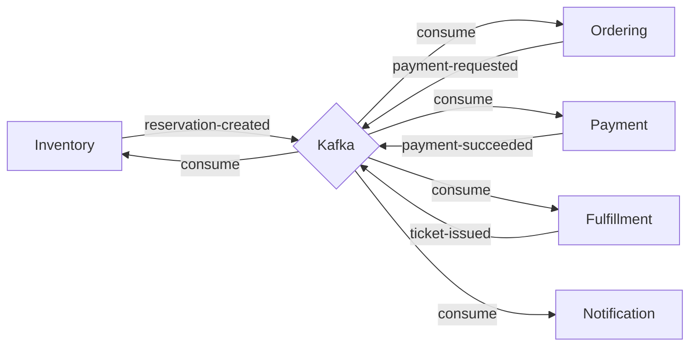
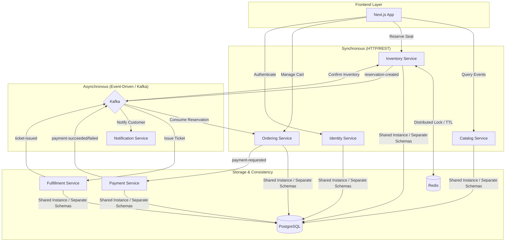

## What is SpecKit Ticketing Platform?

SpecKit Ticketing Platform is a **distributed SaaS platform** for selling event tickets, designed with enterprise-grade architecture patterns including **Hexagonal Architecture**, **CQRS (Command Query Responsibility Segregation)**, and an **Event-Driven** approach. The system guarantees consistency and high availability through distributed locks and asynchronous messaging.

Built on **.NET 9** with a modern microservices architecture, SpecKit demonstrates how to build scalable, maintainable systems that handle high-concurrency scenarios like ticket sales where race conditions must be prevented.

<Note>
This platform is designed for **learning and training purposes**, showcasing real-world architectural patterns in a practical context. All configuration is pre-loaded in `docker-compose.yml` and `appsettings.json` for immediate deployment without manual setup.
</Note>

## Key Features

### Distributed Microservices Architecture

The platform consists of independent, specialized services that communicate through both synchronous and asynchronous channels:

- **Catalog Service** - Event and venue management with seat map queries
- **Inventory Service** - Seat reservation with distributed locking and TTL management
- **Ordering Service** - Shopping cart and order lifecycle management
- **Payment Service** - Payment processing (simulated for MVP, extensible for real providers)
- **Fulfillment Service** - Ticket generation with QR codes and PDF artifacts
- **Notification Service** - Transactional email delivery for order confirmations
- **Identity Service** - Authentication and user management with JWT tokens

### Hexagonal Architecture (Ports & Adapters)

Each microservice follows the hexagonal architecture pattern:

```
┌─────────────────────────────────────────┐
│            API Layer (HTTP)             │  ← Presentation
├─────────────────────────────────────────┤
│       Application (Use Cases)           │  ← MediatR handlers
├─────────────────────────────────────────┤
│          Domain (Business Logic)        │  ← Pure business rules
├─────────────────────────────────────────┤
│    Infrastructure (Adapters)            │  ← EF Core, Kafka, Redis
└─────────────────────────────────────────┘
```

This separation ensures:
- **Testability** - Domain logic has zero infrastructure dependencies
- **Flexibility** - Swap databases or messaging systems without touching business logic
- **Maintainability** - Clear boundaries between layers

### Event-Driven Communication

The system uses **Apache Kafka** for asynchronous choreography of long-running processes:



**Key Events:**
- `reservation-created` - Seat reserved with TTL
- `reservation-expired` - TTL elapsed, seat released
- `payment-succeeded` / `payment-failed` - Payment outcome
- `ticket-issued` - Ticket PDF generated and ready

### CQRS Pattern

Command and query responsibilities are separated:

- **Commands** (writes) - Reserve seat, create order, process payment
- **Queries** (reads) - Get event details, seat map, order status

This separation allows:
- Optimized read models for fast queries
- Complex write operations with business rules enforcement
- Independent scaling of read and write workloads

### Distributed Consistency

**Redis** is used for distributed locking to prevent race conditions during seat reservations:

```csharp
// Pseudo-code
using (var lock = await _redisLock.AcquireAsync(seatId, ttl: 30))
{
    // Only one process can reserve this seat at a time
    var seat = await _repository.GetSeatAsync(seatId);
    if (seat.Status == SeatStatus.Available)
    {
        seat.Reserve(customerId, expiresAt);
        await _repository.SaveAsync(seat);
    }
}
```

**PostgreSQL** provides ACID guarantees with optimistic locking (row versioning) for concurrent updates.

## Technology Stack

### Backend Services

| Component | Technology | Purpose |
|-----------|------------|----------|
| **Runtime** | .NET 9 | Modern, high-performance framework |
| **API** | Minimal APIs | Lightweight HTTP endpoints |
| **Mediator** | MediatR | In-process messaging for CQRS |
| **ORM** | Entity Framework Core | Database access and migrations |
| **Database** | PostgreSQL 17 | Relational database with schema isolation |
| **Cache & Locks** | Redis 7 | Distributed locking and TTL management |
| **Messaging** | Apache Kafka (Confluent) | Event streaming and choreography |
| **Logging** | Serilog | Structured logging |
| **Tracing** | OpenTelemetry | Distributed tracing |

### Frontend

| Component | Technology |
|-----------|------------|
| **Framework** | Next.js 14 (App Router) |
| **Styling** | TailwindCSS |
| **Components** | Shadcn/UI |
| **Language** | TypeScript |

### Infrastructure

| Component | Technology |
|-----------|------------|
| **Containerization** | Docker & Docker Compose |
| **Orchestration** | Zookeeper (for Kafka) |
| **Schema Management** | EF Core Migrations |

## Architecture Overview

The platform uses a **hybrid communication model**:



### Database Schema Isolation

A **single PostgreSQL instance** is shared across all services, but each bounded context owns its own schema:

| Schema | Service | Tables |
|--------|---------|--------|
| `bc_identity` | Identity | users, roles, tokens |
| `bc_catalog` | Catalog | events, venues, seats (read model) |
| `bc_inventory` | Inventory | reservations, seat_availability |
| `bc_ordering` | Ordering | orders, order_items, carts |
| `bc_payment` | Payment | payments, transactions |
| `bc_fulfillment` | Fulfillment | tickets, qr_codes |
| `bc_notification` | Notification | notifications, delivery_logs |

This approach balances:
- **Operational simplicity** - Single database to manage
- **Logical isolation** - Each service owns its data
- **Cost efficiency** - No need for multiple database instances in development

<Warning>
In production, you may want to split into separate database instances for true service independence and scalability.
</Warning>

## Use Cases

### Primary Use Case: Event Ticket Purchase

The core workflow enables customers to:

1. **Browse Events** - View available events with dates, venues, and pricing
2. **Select Seats** - Explore interactive seat maps showing real-time availability
3. **Reserve Temporarily** - Hold seats for 30 minutes with distributed locking
4. **Add to Cart** - Build an order with multiple seats
5. **Complete Payment** - Process payment (simulated or real gateway)
6. **Receive Ticket** - Get PDF ticket with QR code via email

### Concurrency Handling

The platform excels at handling concurrent access:

**Scenario**: 1,000 users try to reserve the same seat simultaneously

```typescript
// Only ONE reservation succeeds
User A: POST /reservations → 200 OK (seat reserved)
User B: POST /reservations → 409 Conflict (seat already reserved)
User C: POST /reservations → 409 Conflict (seat already reserved)
// ... 997 more conflicts
```

This is guaranteed through:
- **Redis distributed locks** (cross-process coordination)
- **PostgreSQL optimistic locking** (row versioning)
- **Idempotency keys** (prevent duplicate operations)

### Reservation Expiration

Reservations automatically expire after 30 minutes:

```
T+0:00  → User reserves seat A1
T+0:01  → Seat status: RESERVED (expires at T+30:00)
T+15:00 → User adds to cart (reservation extended)
T+29:59 → User completes payment → Seat status: SOLD

// Alternative flow:
T+0:00  → User reserves seat A1
T+30:01 → Background job expires reservation
T+30:02 → Seat status: AVAILABLE
T+30:03 → kafka event: reservation-expired
T+30:04 → Inventory releases seat
```

## System Requirements

### Development Environment

- **Docker Desktop** 4.0+ (with Docker Compose v2)
- **Git** 2.30+
- **(Optional) .NET 9 SDK** - Only if developing backend services locally
- **(Optional) Node.js 20+** - Only if developing frontend locally

### Minimum Hardware

- **RAM**: 8 GB (16 GB recommended)
- **CPU**: 4 cores (8 cores recommended)
- **Disk**: 10 GB free space

### Supported Platforms

- macOS 12+ (Intel & Apple Silicon)
- Windows 10/11 with WSL2
- Linux (Ubuntu 20.04+, Debian 11+, Fedora 35+)

## Getting Started

Ready to run the platform? Continue to the [Quickstart Guide](/quickstart) for a 5-minute setup, or dive into the [Installation Guide](/installation) for detailed configuration options.

<CardGroup cols={2}>
  <Card title="Quickstart" icon="rocket" href="/quickstart">
    Get the platform running in 5 minutes
  </Card>
  <Card title="Installation" icon="gear" href="/installation">
    Detailed setup with troubleshooting
  </Card>
</CardGroup>

## Project Documentation

The source repository includes comprehensive documentation:

| Document | Description |
|----------|-------------|
| [AI Workflow](https://github.com/yourrepo/AI_WORKFLOW.MD) | Prompt engineering and AI development process |
| [Human Checks](https://github.com/yourrepo/humanchcks.md) | Manual review and architectural decisions |
| [Technical Debt](https://github.com/yourrepo/deptReport.md) | Known issues and improvement backlog |
| [TDD Report](https://github.com/yourrepo/TDD_report.md) | Test-driven development practices (ATDD) |
| [API Guide](https://github.com/yourrepo/FRONTEND_API_GUIDE.md) | Frontend integration reference |

## Why SpecKit?

SpecKit Ticketing Platform is designed to demonstrate:

### Enterprise Patterns in Practice
- **Hexagonal Architecture** - Clean separation of concerns
- **CQRS** - Command and query separation
- **Event Sourcing Lite** - Domain events for process choreography
- **Saga Pattern** - Distributed transaction management

### Real-World Challenges
- **Concurrency** - Prevent double-booking with distributed locks
- **Consistency** - Maintain data integrity across services
- **Resilience** - Handle partial failures gracefully
- **Observability** - Trace requests across service boundaries

### Modern Technology
- **.NET 9** - Latest framework features
- **Minimal APIs** - Lightweight, performant endpoints
- **Kafka** - Industry-standard event streaming
- **PostgreSQL** - Robust relational database

### Developer Experience
- **Zero configuration** - Everything pre-configured in docker-compose
- **Fast startup** - From clone to running in under 2 minutes
- **Clear documentation** - Step-by-step guides and API references
- **Extensible** - Easy to add new features or swap implementations

## Next Steps

Explore the documentation:

1. **[Quickstart](/quickstart)** - Get running immediately
2. **[Installation](/installation)** - Detailed setup and configuration
3. **[API Reference](/api/catalog/get-events)** - Complete endpoint documentation
4. **[Architecture](/concepts/architecture)** - Deep dive into design decisions
5. **[Development Guide](/installation)** - Contributing and extending the platform

<Tip>
New to microservices or event-driven architecture? Start with the [Quickstart](/quickstart) to see the system in action, then explore the architecture documentation to understand the design patterns.
</Tip>