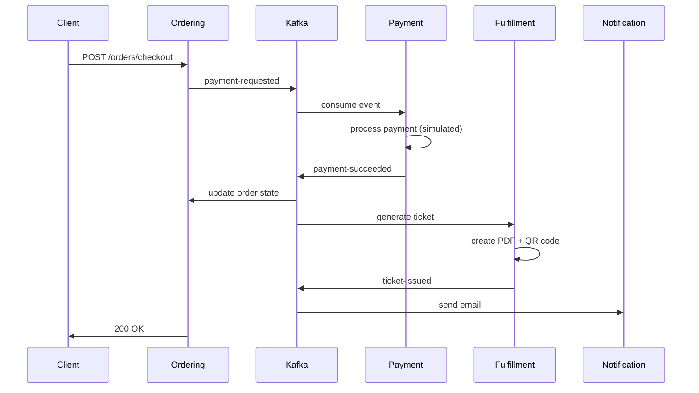

## Get Running in 5 Minutes

This quickstart guide will have the entire SpecKit Ticketing Platform running on your local machine in under 5 minutes. You'll start all microservices, verify they're healthy, make a test reservation, and complete a full checkout flow.

<Note>
This guide assumes you have **Docker Desktop** installed and running. If you don't have Docker yet, see the [Installation Guide](/installation) for prerequisites.
</Note>

## Quick Overview

Here's what we'll accomplish:

<Steps>
  <Step title="Clone and Navigate">
    Get the source code and navigate to the infrastructure directory
  </Step>
  
  <Step title="Start All Services">
    Launch 7 microservices + PostgreSQL + Redis + Kafka with one command
  </Step>
  
  <Step title="Verify Health">
    Confirm all services are running and healthy
  </Step>
  
  <Step title="Make a Reservation">
    Reserve a seat using the REST API
  </Step>
  
  <Step title="Complete Checkout">
    Add to cart and complete the payment flow
  </Step>
</Steps>

---

## Step 1: Clone and Navigate

Clone the repository and navigate to the infrastructure directory:

<CodeGroup>

```bash SSH
git clone https://github.com/yourorg/speckit-ticketing.git
cd speckit-ticketing/infra
```

```bash HTTPS
git clone https://github.com/yourorg/speckit-ticketing.git
cd speckit-ticketing/infra
```

</CodeGroup>

<Tip>
The `infra` directory contains the `docker-compose.yml` file that orchestrates all services.
</Tip>

---

## Step 2: Start All Services

Start the entire platform with Docker Compose:

```bash
docker compose up -d
```

<Note>
The `-d` flag runs containers in detached mode (background). Initial startup takes 30-60 seconds as images are built and services initialize.
</Note>

### What's Starting?

This single command launches:

**Infrastructure:**
- PostgreSQL 17 (port 5432)
- Redis 7 (port 6379)
- Kafka + Zookeeper (port 9092)

**Microservices:**
- Identity Service (port 50000)
- Catalog Service (port 50001)
- Inventory Service (port 50002)
- Ordering Service (port 5003)
- Payment Service (port 5004)
- Fulfillment Service (port 50004)
- Notification Service (port 50005)

**Frontend:**
- Next.js App (port 3000)

### Monitor Startup Progress

Watch the logs in real-time:

```bash
docker compose logs -f
```

Press `Ctrl+C` to stop following logs (containers keep running).

<Warning>
Wait for the message `"Topics created successfully!"` from `kafka-init` before proceeding. This ensures Kafka topics are ready.
</Warning>

---

## Step 3: Verify Health

Check that all services are healthy:

```bash
docker compose ps
```

**Expected output:**
```
NAME                     STATUS              PORTS
speckit-catalog          Up (healthy)        0.0.0.0:50001->5001/tcp
speckit-identity         Up (healthy)        0.0.0.0:50000->5000/tcp
speckit-inventory        Up (healthy)        0.0.0.0:50002->5002/tcp
speckit-kafka            Up (healthy)        0.0.0.0:9092->9092/tcp
speckit-ordering         Up (healthy)        0.0.0.0:5003->5003/tcp
speckit-payment          Up (healthy)        0.0.0.0:5004->5004/tcp
speckit-postgres         Up (healthy)        0.0.0.0:5432->5432/tcp
speckit-redis            Up (healthy)        0.0.0.0:6379->6379/tcp
...
```

<Tip>
All services should show `Up (healthy)`. If any show `Up` without `(healthy)`, wait 10-20 more seconds for health checks to pass.
</Tip>

### Test Individual Services

Verify services respond to health check endpoints:

<CodeGroup>

```bash Catalog Service
curl http://localhost:50001/health
# Expected: {"status":"Healthy","service":"Catalog"}
```

```bash Inventory Service
curl http://localhost:50002/health
# Expected: {"status":"Healthy","service":"Inventory"}
```

```bash Ordering Service
curl http://localhost:5003/health
# Expected: {"status":"Healthy","service":"Ordering"}
```

```bash Payment Service
curl http://localhost:5004/health
# Expected: {"status":"Healthy","service":"Payment"}
```

</CodeGroup>

### Access the Frontend

Open your browser to:

```
http://localhost:3000
```

You should see the SpecKit Ticketing homepage.

---

## Step 4: Make a Reservation

Now let's interact with the API to reserve a seat. We'll use the complete purchase flow.

### Get Event and Seatmap

First, retrieve an event with its seat availability:

```bash
curl http://localhost:50001/events/550e8400-e29b-41d4-a716-446655440000/seatmap
```

**Response (example):**
```json
{
  "id": "550e8400-e29b-41d4-a716-446655440000",
  "name": "Coldplay - Live in Santiago",
  "description": "World tour 2026",
  "eventDate": "2026-03-15T19:00:00Z",
  "basePrice": 50.00,
  "seats": [
    {
      "id": "550e8400-e29b-41d4-a716-446655440002",
      "sectionCode": "A",
      "rowNumber": 1,
      "seatNumber": 2,
      "price": 50.00,
      "status": "available"
    },
    {
      "id": "550e8400-e29b-41d4-a716-446655440003",
      "sectionCode": "A",
      "rowNumber": 1,
      "seatNumber": 3,
      "price": 50.00,
      "status": "reserved"
    }
  ]
}
```

<Note>
Look for a seat with `"status": "available"` to reserve. Copy its `id` for the next step.
</Note>

### Reserve a Seat

Create a reservation for an available seat:

```bash
curl -X POST http://localhost:50002/reservations \
  -H "Content-Type: application/json" \
  -d '{
    "seatId": "550e8400-e29b-41d4-a716-446655440002",
    "customerId": "customer-quickstart-001"
  }'
```

**Response:**
```json
{
  "reservationId": "8bf7fffc-9ff5-401c-9d2d-86f525f42e40",
  "seatId": "550e8400-e29b-41d4-a716-446655440002",
  "customerId": "customer-quickstart-001",
  "expiresAt": "2026-03-04T21:15:00Z",
  "status": "active"
}
```

<Warning>
**Important**: Copy the `reservationId` from the response. You'll need it for checkout.

Also, **wait 2-3 seconds** before proceeding. The reservation event needs to propagate through Kafka to the Ordering service.
</Warning>

```bash
# Wait for event processing
sleep 3
```

---

## Step 5: Complete Checkout

Now let's add the reserved seat to cart and complete the purchase.

### Add to Cart

Add the reservation to your shopping cart:

```bash
curl -X POST http://localhost:5003/cart/add \
  -H "Content-Type: application/json" \
  -d '{
    "reservationId": "8bf7fffc-9ff5-401c-9d2d-86f525f42e40",
    "seatId": "550e8400-e29b-41d4-a716-446655440002",
    "price": 50.00,
    "userId": "customer-quickstart-001"
  }'
```

<Tip>
Replace `reservationId` and `seatId` with the values from your reservation response.
</Tip>

**Response:**
```json
{
  "id": "order-uuid-001",
  "userId": "customer-quickstart-001",
  "guestToken": null,
  "totalAmount": 50.00,
  "state": "draft",
  "createdAt": "2026-03-04T20:45:00Z",
  "paidAt": null,
  "items": [
    {
      "id": "item-001",
      "seatId": "550e8400-e29b-41d4-a716-446655440002",
      "price": 50.00
    }
  ]
}
```

**Copy the `id` (order ID)** for the final step.

### Complete Payment

Finalize the purchase with checkout:

```bash
curl -X POST http://localhost:5003/orders/checkout \
  -H "Content-Type: application/json" \
  -d '{
    "orderId": "order-uuid-001",
    "userId": "customer-quickstart-001"
  }'
```

**Response:**
```json
{
  "id": "order-uuid-001",
  "userId": "customer-quickstart-001",
  "guestToken": null,
  "totalAmount": 50.00,
  "state": "pending",
  "createdAt": "2026-03-04T20:45:00Z",
  "paidAt": "2026-03-04T20:46:30Z",
  "items": [
    {
      "id": "item-001",
      "seatId": "550e8400-e29b-41d4-a716-446655440002",
      "price": 50.00
    }
  ]
}
```

<Note>
The order `state` transitions from `draft` → `pending` → `completed` as the payment processes and ticket is issued.
</Note>

### Behind the Scenes

When you called `/orders/checkout`, this event cascade was triggered:



---

## Complete End-to-End Script

Here's a complete bash script that runs the entire flow:

```bash quickstart-test.sh
#!/bin/bash

EVENT_ID="550e8400-e29b-41d4-a716-446655440000"
SEAT_ID="550e8400-e29b-41d4-a716-446655440002"
USER_ID="customer-quickstart-$(date +%s)"

echo "🎫 SpecKit Ticketing Platform - Quickstart Test"
echo "================================================"

# Step 1: Get event seatmap
echo "\n1️⃣  Getting event seatmap..."
EVENT=$(curl -s http://localhost:50001/events/$EVENT_ID/seatmap)
PRICE=$(echo $EVENT | jq -r '.basePrice')
echo "   Event: $(echo $EVENT | jq -r '.name')"
echo "   Price: \$$PRICE"

# Step 2: Reserve seat
echo "\n2️⃣  Reserving seat..."
RESERVATION=$(curl -s -X POST http://localhost:50002/reservations \
  -H "Content-Type: application/json" \
  -d "{\"seatId\":\"$SEAT_ID\",\"customerId\":\"$USER_ID\"}")
RESERVATION_ID=$(echo $RESERVATION | jq -r '.reservationId')
echo "   Reservation ID: $RESERVATION_ID"
echo "   Expires at: $(echo $RESERVATION | jq -r '.expiresAt')"

# Step 3: Wait for Kafka event processing
echo "\n3️⃣  Waiting for event processing (3 seconds)..."
sleep 3

# Step 4: Add to cart
echo "\n4️⃣  Adding to cart..."
ORDER=$(curl -s -X POST http://localhost:5003/cart/add \
  -H "Content-Type: application/json" \
  -d "{\"reservationId\":\"$RESERVATION_ID\",\"seatId\":\"$SEAT_ID\",\"price\":$PRICE,\"userId\":\"$USER_ID\"}")
ORDER_ID=$(echo $ORDER | jq -r '.id')
echo "   Order ID: $ORDER_ID"
echo "   Total: \$$(echo $ORDER | jq -r '.totalAmount')"

# Step 5: Checkout
echo "\n5️⃣  Checking out..."
FINAL=$(curl -s -X POST http://localhost:5003/orders/checkout \
  -H "Content-Type: application/json" \
  -d "{\"orderId\":\"$ORDER_ID\",\"userId\":\"$USER_ID\"}")
echo "   Order State: $(echo $FINAL | jq -r '.state')"
echo "   Paid at: $(echo $FINAL | jq -r '.paidAt')"

echo "\n✅ Purchase complete!"
echo "\nFinal order:"
echo $FINAL | jq .
```

Make it executable and run:

```bash
chmod +x quickstart-test.sh
./quickstart-test.sh
```

---

## What's Next?

<CardGroup cols={2}>
  <Card title="API Reference" icon="code" href="/api/catalog/get-events">
    Explore all available endpoints
  </Card>
  
  <Card title="Architecture" icon="diagram-project" href="/concepts/architecture">
    Understand the system design
  </Card>
  
  <Card title="Installation" icon="gear" href="/installation">
    Detailed setup and configuration
  </Card>
  
  <Card title="Development" icon="laptop-code" href="/installation">
    Build features and contribute
  </Card>
</CardGroup>

## Troubleshooting

### Services Not Starting

If services fail to start or show unhealthy:

```bash
# Check logs for specific service
docker compose logs catalog

# Restart all services
docker compose restart

# Full reset (removes all data)
docker compose down -v
docker compose up -d
```

### "Reservation not found" Error

**Cause**: The Kafka event hasn't reached Ordering service yet.

**Solution**: Wait 3-5 seconds after creating reservation before adding to cart.

```bash
# After POST /reservations
sleep 3
# Then POST /cart/add
```

### Port Already in Use

If you see `port is already allocated`:

```bash
# Find what's using the port (e.g., 5432)
lsof -i :5432

# Stop the conflicting process or change docker-compose port mappings
```

### Connection Refused

**Cause**: Service hasn't fully initialized.

**Solution**: Wait for health checks to pass:

```bash
# Watch until all services show (healthy)
watch -n 1 'docker compose ps'
```

## Clean Up

When you're done experimenting:

```bash
# Stop all services (preserves data)
docker compose stop

# Remove containers (preserves data)
docker compose down

# Remove everything including volumes (DELETES ALL DATA)
docker compose down -v
```

<Warning>
The `-v` flag deletes all database data, reservations, and orders. Only use this when you want a fresh start.
</Warning>

## Learn More

Now that you've seen the platform in action:

- **[Installation Guide](/installation)** - Deep dive into setup, environment variables, and production considerations
- **[API Reference](/api/catalog/get-events)** - Complete endpoint documentation with request/response examples
- **[Architecture Guide](/concepts/architecture)** - Learn about hexagonal architecture, CQRS, and event-driven patterns
- **[Development Guide](/installation)** - Set up your development environment and contribute features

<Tip>
The fastest way to learn the codebase is to modify one service. Try changing the reservation TTL from 30 minutes to 5 minutes in the Inventory service.
</Tip>